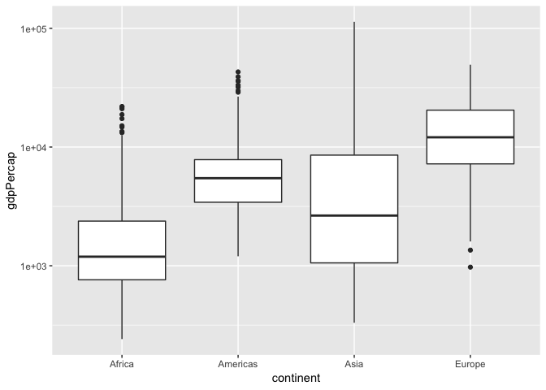
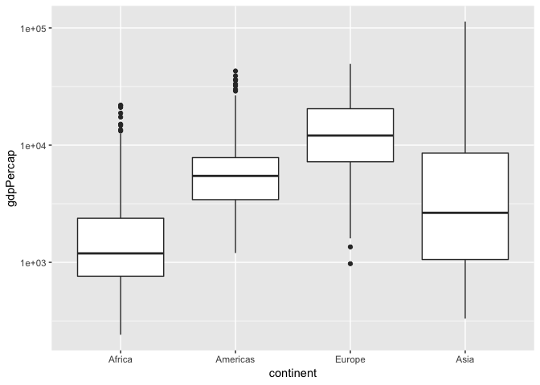
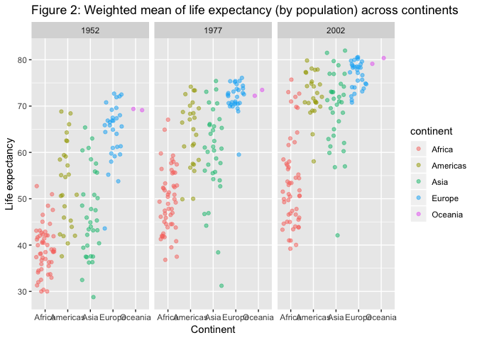
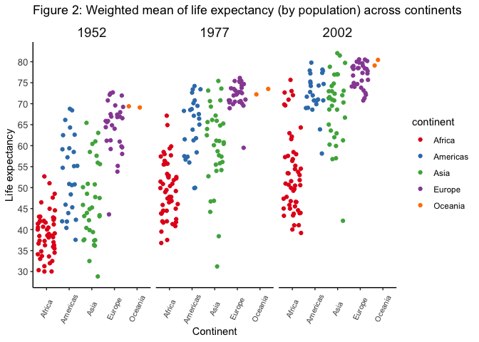

STAT545\_hw05\_exploration
================

``` r
library(gapminder)
library(tidyverse)
```

    ## ── Attaching packages ─────────────────────────────────────────────────────────── tidyverse 1.2.1 ──

    ## ✔ ggplot2 3.0.0     ✔ purrr   0.2.5
    ## ✔ tibble  1.4.2     ✔ dplyr   0.7.6
    ## ✔ tidyr   0.8.1     ✔ stringr 1.3.1
    ## ✔ readr   1.1.1     ✔ forcats 0.3.0

    ## ── Conflicts ────────────────────────────────────────────────────────────── tidyverse_conflicts() ──
    ## ✖ dplyr::filter() masks stats::filter()
    ## ✖ dplyr::lag()    masks stats::lag()

``` r
library(plotly)
```

    ## 
    ## Attaching package: 'plotly'

    ## The following object is masked from 'package:ggplot2':
    ## 
    ##     last_plot

    ## The following object is masked from 'package:stats':
    ## 
    ##     filter

    ## The following object is masked from 'package:graphics':
    ## 
    ##     layout

``` r
library(scales)
```

    ## 
    ## Attaching package: 'scales'

    ## The following object is masked from 'package:purrr':
    ## 
    ##     discard

    ## The following object is masked from 'package:readr':
    ## 
    ##     col_factor

``` r
library(RColorBrewer)
library(pkgconfig)
```

# Part 1: Factor management

Let’s compare the use of filter() vs droplevels() upon removing
“Oceania” from the gapminder data set.

``` r
gap_filter <- gapminder %>% 
  filter(continent != "Oceania")

gap_drop <- gap_filter %>% 
  droplevels()

str(gapminder)
```

    ## Classes 'tbl_df', 'tbl' and 'data.frame':    1704 obs. of  6 variables:
    ##  $ country  : Factor w/ 142 levels "Afghanistan",..: 1 1 1 1 1 1 1 1 1 1 ...
    ##  $ continent: Factor w/ 5 levels "Africa","Americas",..: 3 3 3 3 3 3 3 3 3 3 ...
    ##  $ year     : int  1952 1957 1962 1967 1972 1977 1982 1987 1992 1997 ...
    ##  $ lifeExp  : num  28.8 30.3 32 34 36.1 ...
    ##  $ pop      : int  8425333 9240934 10267083 11537966 13079460 14880372 12881816 13867957 16317921 22227415 ...
    ##  $ gdpPercap: num  779 821 853 836 740 ...

``` r
str(gap_filter)
```

    ## Classes 'tbl_df', 'tbl' and 'data.frame':    1680 obs. of  6 variables:
    ##  $ country  : Factor w/ 142 levels "Afghanistan",..: 1 1 1 1 1 1 1 1 1 1 ...
    ##  $ continent: Factor w/ 5 levels "Africa","Americas",..: 3 3 3 3 3 3 3 3 3 3 ...
    ##  $ year     : int  1952 1957 1962 1967 1972 1977 1982 1987 1992 1997 ...
    ##  $ lifeExp  : num  28.8 30.3 32 34 36.1 ...
    ##  $ pop      : int  8425333 9240934 10267083 11537966 13079460 14880372 12881816 13867957 16317921 22227415 ...
    ##  $ gdpPercap: num  779 821 853 836 740 ...

``` r
str(gap_drop)
```

    ## Classes 'tbl_df', 'tbl' and 'data.frame':    1680 obs. of  6 variables:
    ##  $ country  : Factor w/ 140 levels "Afghanistan",..: 1 1 1 1 1 1 1 1 1 1 ...
    ##  $ continent: Factor w/ 4 levels "Africa","Americas",..: 3 3 3 3 3 3 3 3 3 3 ...
    ##  $ year     : int  1952 1957 1962 1967 1972 1977 1982 1987 1992 1997 ...
    ##  $ lifeExp  : num  28.8 30.3 32 34 36.1 ...
    ##  $ pop      : int  8425333 9240934 10267083 11537966 13079460 14880372 12881816 13867957 16317921 22227415 ...
    ##  $ gdpPercap: num  779 821 853 836 740 ...

*Comments:* Use of filter() does not effect a change in the number of
levels in country (142) or continent (5) factors, whereas droplevels()
displays only the observed levels in country (140) and continent (4)
factors. As expected, the dropped level in continent is “Oceania”;
correspondingly, the dropped levels in country are “Australia” and “New
Zealand”.

Next, let’s compare the use of arrange() and fct\_reorder() to
reorganize continent by GDP per capita.

``` r
#With arrange()
gap_A <- gap_drop %>% 
  arrange(continent, gdpPercap)

#Reordered factors
gap_R <- gap_drop %>% 
  mutate(continent = fct_reorder(continent, gdpPercap, .fun = max))

#Reordered factors and with arrange()
gap_RA <- gap_R %>% 
  arrange(continent, gdpPercap)


head(gap_drop)
```

    ## # A tibble: 6 x 6
    ##   country     continent  year lifeExp      pop gdpPercap
    ##   <fct>       <fct>     <int>   <dbl>    <int>     <dbl>
    ## 1 Afghanistan Asia       1952    28.8  8425333      779.
    ## 2 Afghanistan Asia       1957    30.3  9240934      821.
    ## 3 Afghanistan Asia       1962    32.0 10267083      853.
    ## 4 Afghanistan Asia       1967    34.0 11537966      836.
    ## 5 Afghanistan Asia       1972    36.1 13079460      740.
    ## 6 Afghanistan Asia       1977    38.4 14880372      786.

``` r
head(gap_A)
```

    ## # A tibble: 6 x 6
    ##   country          continent  year lifeExp      pop gdpPercap
    ##   <fct>            <fct>     <int>   <dbl>    <int>     <dbl>
    ## 1 Congo, Dem. Rep. Africa     2002    45.0 55379852      241.
    ## 2 Congo, Dem. Rep. Africa     2007    46.5 64606759      278.
    ## 3 Lesotho          Africa     1952    42.1   748747      299.
    ## 4 Guinea-Bissau    Africa     1952    32.5   580653      300.
    ## 5 Congo, Dem. Rep. Africa     1997    42.6 47798986      312.
    ## 6 Eritrea          Africa     1952    35.9  1438760      329.

``` r
head(gap_R)
```

    ## # A tibble: 6 x 6
    ##   country     continent  year lifeExp      pop gdpPercap
    ##   <fct>       <fct>     <int>   <dbl>    <int>     <dbl>
    ## 1 Afghanistan Asia       1952    28.8  8425333      779.
    ## 2 Afghanistan Asia       1957    30.3  9240934      821.
    ## 3 Afghanistan Asia       1962    32.0 10267083      853.
    ## 4 Afghanistan Asia       1967    34.0 11537966      836.
    ## 5 Afghanistan Asia       1972    36.1 13079460      740.
    ## 6 Afghanistan Asia       1977    38.4 14880372      786.

``` r
head(gap_RA)
```

    ## # A tibble: 6 x 6
    ##   country          continent  year lifeExp      pop gdpPercap
    ##   <fct>            <fct>     <int>   <dbl>    <int>     <dbl>
    ## 1 Congo, Dem. Rep. Africa     2002    45.0 55379852      241.
    ## 2 Congo, Dem. Rep. Africa     2007    46.5 64606759      278.
    ## 3 Lesotho          Africa     1952    42.1   748747      299.
    ## 4 Guinea-Bissau    Africa     1952    32.5   580653      300.
    ## 5 Congo, Dem. Rep. Africa     1997    42.6 47798986      312.
    ## 6 Eritrea          Africa     1952    35.9  1438760      329.

``` r
levels(gap_drop$continent)
```

    ## [1] "Africa"   "Americas" "Asia"     "Europe"

``` r
levels(gap_A$continent)
```

    ## [1] "Africa"   "Americas" "Asia"     "Europe"

``` r
levels(gap_R$continent)
```

    ## [1] "Africa"   "Americas" "Europe"   "Asia"

``` r
levels(gap_RA$continent)
```

    ## [1] "Africa"   "Americas" "Europe"   "Asia"

*Comments:* In the head of the tables displayed above, it is seen that
the use of arrange() reorganizes GDP per capita in ascending order
within each continent grouping. The use of fct\_reorder() has no
observable effect on the table itself. The use of both functions leads
only to the observable effects of arrange().

Usings levels() to check the factor levels, there is no difference after
using arrange(). After fct\_reorder(), the order of the factors changes.
In this case, Europe has the second highest maximum, so fct\_reorder()
has changed its position accordingly from the default alphabetical
ordering of contient factors.

Let’s check the
plots:

``` r
gap_drop %>% ggplot(aes(continent, gdpPercap)) + geom_boxplot() + scale_y_log10()
```

<!-- -->

``` r
gap_A %>% ggplot(aes(continent, gdpPercap)) + geom_boxplot() + scale_y_log10()
```

<!-- -->

``` r
gap_R %>% ggplot(aes(continent, gdpPercap)) + geom_boxplot() + scale_y_log10()
```

<!-- -->

``` r
gap_RA %>% ggplot(aes(continent, gdpPercap)) + geom_boxplot() + scale_y_log10()
```

<!-- -->

*Comments:* The use of arrange() only operates on the table output and
has no effect on the plot. This makes sense intuitively, as the data
points are still the same and thus the plot output will be the same, so
long as the grouping is still by continent and plotted against GDP per
capita. The use of fct\_reorder() on the other hand does lead to an
observable difference in the plot. Here, I called the function to
reorder by the summary statistic maximum, so that the boxplot is
arranged in order of increasing maxima. The ordering of the factors is
the same as that observed using levels() above.

# Part 2: Files I/O

Let’s output gap\_RA tibble to a CSV file and then read it back in
again.

``` r
write_csv(gap_RA, "gap_RA.csv")

check_gap_RA <- read_csv("gap_RA.csv")
```

    ## Parsed with column specification:
    ## cols(
    ##   country = col_character(),
    ##   continent = col_character(),
    ##   year = col_integer(),
    ##   lifeExp = col_double(),
    ##   pop = col_integer(),
    ##   gdpPercap = col_double()
    ## )

``` r
head(gap_RA)
```

    ## # A tibble: 6 x 6
    ##   country          continent  year lifeExp      pop gdpPercap
    ##   <fct>            <fct>     <int>   <dbl>    <int>     <dbl>
    ## 1 Congo, Dem. Rep. Africa     2002    45.0 55379852      241.
    ## 2 Congo, Dem. Rep. Africa     2007    46.5 64606759      278.
    ## 3 Lesotho          Africa     1952    42.1   748747      299.
    ## 4 Guinea-Bissau    Africa     1952    32.5   580653      300.
    ## 5 Congo, Dem. Rep. Africa     1997    42.6 47798986      312.
    ## 6 Eritrea          Africa     1952    35.9  1438760      329.

``` r
head(check_gap_RA)
```

    ## # A tibble: 6 x 6
    ##   country          continent  year lifeExp      pop gdpPercap
    ##   <chr>            <chr>     <int>   <dbl>    <int>     <dbl>
    ## 1 Congo, Dem. Rep. Africa     2002    45.0 55379852      241.
    ## 2 Congo, Dem. Rep. Africa     2007    46.5 64606759      278.
    ## 3 Lesotho          Africa     1952    42.1   748747      299.
    ## 4 Guinea-Bissau    Africa     1952    32.5   580653      300.
    ## 5 Congo, Dem. Rep. Africa     1997    42.6 47798986      312.
    ## 6 Eritrea          Africa     1952    35.9  1438760      329.

*Comments:* The head of gap\_RA and the newly read-in CSV stored in
check\_gap\_RA look to be the same. Success\!

# Part 2: Visualization design

*Preamble:* Let’s revisit a plot made using `ggplot` from a previous
assignment and make it even better. I have chosen to use the following
plot: Weighted mean of life expectancy (by population) across
continents.

``` r
#Set up parameters of the plot by finding the weighted mean by population, and then storing in a new tibble, A.
A <- gapminder %>% 
      filter(year == 1952 | year == 2002 | year == 1977) %>% 
      group_by(continent, country, year) %>% #Grouping by year in order to facet plot later
      mutate(wm = round(weighted.mean(lifeExp, pop, na.rm = FALSE), digits = 1)) %>% 
      transmute(lifeExp, pop, wm) #transmute removes all columns other than the ones specified

#Create a ggplot (this is the original)

P <- ggplot(A, aes(x = continent, y = wm, color = continent)) +
  geom_jitter(alpha = 0.5) + 
  labs(title = "Figure 2: Weighted mean of life expectancy (by population) across continents", 
       x = "Continent", y = "Life expectancy") + #Add title and axis labels
  facet_grid(.~year) #Facet by year. In this case, 'A' has three years of data.

P
```

<!-- -->

``` r
#Create an improved ggplot

P_new <- ggplot(A, aes(x = continent, y = wm, color = continent)) +
  geom_jitter() + 
  labs(title = "Figure 2: Weighted mean of life expectancy (by population) across continents", 
       x = "Continent", y = "Life expectancy") + #Add title and axis labels
  facet_grid(.~year) +
  theme_classic() + #Removes grid lines for a cleaner look
  theme(axis.text.x  = element_text(angle=65, vjust=0.5, size=8),
        axis.text = element_text(size = 10),
        strip.background = element_rect(colour = "white"),
        strip.text = element_text(size = 14)
        ) +
  scale_y_continuous(breaks = 1:20 * 5) +
  scale_colour_brewer(palette = "Set1")

P_new
```

<!-- -->

``` r
#Convert this to a `plotly` plot:
 
ggplotly(P_new)
```

<!--html_preserve-->

<div id="htmlwidget-d17bf1f0aef9961b7530" class="plotly html-widget" style="width:672px;height:480px;">

</div>

<script type="application/json" data-for="htmlwidget-d17bf1f0aef9961b7530">{"x":{"data":[{"x":[1.32973177805543,0.945083907991648,1.37244349103421,0.759737808257341,1.17676439136267,0.89343405906111,1.28071934320033,0.687679125368595,0.950941735878587,1.32949084118009,1.16727192550898,1.15357064269483,0.802581283636391,0.759320944733918,1.30346747282892,0.901701337471604,1.16819522175938,1.01639513149858,0.605345125682652,0.839070532284677,0.766815910860896,1.1987356742844,1.26055496875197,0.900318928807974,1.26248659230769,0.88337310180068,1.31394205149263,0.66416611969471,1.00795475021005,0.973592500388622,0.853840497136116,0.60763770584017,1.29894416499883,1.30600780304521,1.34802550692111,1.11576740127057,0.707079403102398,1.36741313505918,1.13847013637424,1.19783593453467,1.03506934475154,0.840650666877627,1.36564224660397,1.24869371708483,0.956761572137475,0.674247778207064,0.891810059174895,1.36886195596308,0.993028138019145,0.887797821313143,0.926200184598565,1.34389056134969],"y":[43.0909983647242,29.9676444558427,38.2128271272779,47.6273273969255,32.0041956531815,39.0016765403003,38.4677166917361,35.5336573653109,38.1389926737919,40.6661116310582,39.0832122375816,42.0808262300864,40.5152313048393,34.7783508902416,41.8784902446344,34.4660388719663,35.8783143254183,34.0932418049499,37.0391386951506,30.020108557567,43.0975997012109,33.5671468854323,32.4822254067287,42.3235625890829,42.061730078999,38.5010871556588,42.664838117417,36.7353357797302,36.2832373872772,33.739151199609,40.4873099001683,50.9748200688511,42.8976201649383,31.3138099958375,41.6914212535135,37.4046794436127,36.2750192046352,52.7338377071358,40.0370752600394,46.5330134809948,37.3358164394274,30.3244638947211,33.0072094421275,45.0071632510051,38.5855281374604,41.3824556794949,41.2044666200131,38.5987600454688,44.6397991935909,40.0267494387925,41.9625984322652,48.5052045630664],"text":["continent: Africa<br />wm: 43.1<br />continent: Africa","continent: Africa<br />wm: 30.0<br />continent: Africa","continent: Africa<br />wm: 38.2<br />continent: Africa","continent: Africa<br />wm: 47.6<br />continent: Africa","continent: Africa<br />wm: 32.0<br />continent: Africa","continent: Africa<br />wm: 39.0<br />continent: Africa","continent: Africa<br />wm: 38.5<br />continent: Africa","continent: Africa<br />wm: 35.5<br />continent: Africa","continent: Africa<br />wm: 38.1<br />continent: Africa","continent: Africa<br />wm: 40.7<br />continent: Africa","continent: Africa<br />wm: 39.1<br />continent: Africa","continent: Africa<br />wm: 42.1<br />continent: Africa","continent: Africa<br />wm: 40.5<br />continent: Africa","continent: Africa<br />wm: 34.8<br />continent: Africa","continent: Africa<br />wm: 41.9<br />continent: Africa","continent: Africa<br />wm: 34.5<br />continent: Africa","continent: Africa<br />wm: 35.9<br />continent: Africa","continent: Africa<br />wm: 34.1<br />continent: Africa","continent: Africa<br />wm: 37.0<br />continent: Africa","continent: Africa<br />wm: 30.0<br />continent: Africa","continent: Africa<br />wm: 43.1<br />continent: Africa","continent: Africa<br />wm: 33.6<br />continent: Africa","continent: Africa<br />wm: 32.5<br />continent: Africa","continent: Africa<br />wm: 42.3<br />continent: Africa","continent: Africa<br />wm: 42.1<br />continent: Africa","continent: Africa<br />wm: 38.5<br />continent: Africa","continent: Africa<br />wm: 42.7<br />continent: Africa","continent: Africa<br />wm: 36.7<br />continent: Africa","continent: Africa<br />wm: 36.3<br />continent: Africa","continent: Africa<br />wm: 33.7<br />continent: Africa","continent: Africa<br />wm: 40.5<br />continent: Africa","continent: Africa<br />wm: 51.0<br />continent: Africa","continent: Africa<br />wm: 42.9<br />continent: Africa","continent: Africa<br />wm: 31.3<br />continent: Africa","continent: Africa<br />wm: 41.7<br />continent: Africa","continent: Africa<br />wm: 37.4<br />continent: Africa","continent: Africa<br />wm: 36.3<br />continent: Africa","continent: Africa<br />wm: 52.7<br />continent: Africa","continent: Africa<br />wm: 40.0<br />continent: Africa","continent: Africa<br />wm: 46.5<br />continent: Africa","continent: Africa<br />wm: 37.3<br />continent: Africa","continent: Africa<br />wm: 30.3<br />continent: Africa","continent: Africa<br />wm: 33.0<br />continent: Africa","continent: Africa<br />wm: 45.0<br />continent: Africa","continent: Africa<br />wm: 38.6<br />continent: Africa","continent: Africa<br />wm: 41.4<br />continent: Africa","continent: Africa<br />wm: 41.2<br />continent: Africa","continent: Africa<br />wm: 38.6<br />continent: Africa","continent: Africa<br />wm: 44.6<br />continent: Africa","continent: Africa<br />wm: 40.0<br />continent: Africa","continent: Africa<br />wm: 42.0<br />continent: Africa","continent: Africa<br />wm: 48.5<br />continent: Africa"],"type":"scatter","mode":"markers","marker":{"autocolorscale":false,"color":"rgba(228,26,28,1)","opacity":1,"size":5.66929133858268,"symbol":"circle","line":{"width":1.88976377952756,"color":"rgba(228,26,28,1)"}},"hoveron":"points","name":"Africa","legendgroup":"Africa","showlegend":true,"xaxis":"x","yaxis":"y","hoverinfo":"text","frame":null},{"x":[1.19890832845122,1.00816370267421,0.990147904120386,0.837273554317653,1.03566734846681,1.01227299403399,0.699584996514022,1.08481661062688,1.37825934439898,0.611264009959996,1.31694734152406,0.924075411446392,0.926768442429602,0.679258055239916,1.21521662771702,0.622233115695417,1.20426471624523,0.994549001194537,1.16560580115765,0.711541718617082,1.29796377792954,1.11374773494899,1.29175734911114,1.09774967152625,1.20084880609065,0.747327121905982,1.00400879252702,1.30685794763267,1.31424923948944,0.910834432020783,0.879630910977721,1.12709876317531,1.04073500074446,1.00951226018369,1.35847353674471,0.700184432417154,0.847717461362481,1.140378395468,0.627353747934103,0.614587411656976,0.841091369092464,0.820033200830221,0.802538660168648,0.808537394553423,0.730664048530161,0.707895408011973,0.654348321445286,1.21669085212052,1.24639422297478,1.22150188293308,1.12918283510953,0.926638107188046],"y":[58.0282259005867,39.531711743921,49.1986293435283,59.3138209436461,46.0734718270041,45.9111559154466,49.3799652997032,46.7667433491349,47.4354806868359,50.8701005998626,47.8184248878062,55.5984393248893,52.4246158775687,46.4837177866511,53.3186577917635,41.97805534821,44.5004467716627,44.5380175404064,52.8107041887008,41.7698975321092,51.7693098432384,40.7679228275456,37.5390494053438,56.2008052648045,52.2346273556538,43.8186032379046,57.3614090272412,46.8832970321178,43.8069749914668,41.6715349056013,50.898265407905,64.8837560450099,55.7179565292597,42.4608763981611,56.3806645403057,41.3024966879562,44.4715686223097,67.1185533746891,45.0058913677558,58.5397567407042,48.8677847115323,36.7649226473086,41.9922317202017,55.5160777176917,47.7958600422554,52.4961413425021,49.9139882638864,52.8822506467998,59.8183718239143,50.4005901944451,51.4001085804403,57.7067530929297],"text":["continent: Africa<br />wm: 58.0<br />continent: Africa","continent: Africa<br />wm: 39.5<br />continent: Africa","continent: Africa<br />wm: 49.2<br />continent: Africa","continent: Africa<br />wm: 59.3<br />continent: Africa","continent: Africa<br />wm: 46.1<br />continent: Africa","continent: Africa<br />wm: 45.9<br />continent: Africa","continent: Africa<br />wm: 49.4<br />continent: Africa","continent: Africa<br />wm: 46.8<br />continent: Africa","continent: Africa<br />wm: 47.4<br />continent: Africa","continent: Africa<br />wm: 50.9<br />continent: Africa","continent: Africa<br />wm: 47.8<br />continent: Africa","continent: Africa<br />wm: 55.6<br />continent: Africa","continent: Africa<br />wm: 52.4<br />continent: Africa","continent: Africa<br />wm: 46.5<br />continent: Africa","continent: Africa<br />wm: 53.3<br />continent: Africa","continent: Africa<br />wm: 42.0<br />continent: Africa","continent: Africa<br />wm: 44.5<br />continent: Africa","continent: Africa<br />wm: 44.5<br />continent: Africa","continent: Africa<br />wm: 52.8<br />continent: Africa","continent: Africa<br />wm: 41.8<br />continent: Africa","continent: Africa<br />wm: 51.8<br />continent: Africa","continent: Africa<br />wm: 40.8<br />continent: Africa","continent: Africa<br />wm: 37.5<br />continent: Africa","continent: Africa<br />wm: 56.2<br />continent: Africa","continent: Africa<br />wm: 52.2<br />continent: Africa","continent: Africa<br />wm: 43.8<br />continent: Africa","continent: Africa<br />wm: 57.4<br />continent: Africa","continent: Africa<br />wm: 46.9<br />continent: Africa","continent: Africa<br />wm: 43.8<br />continent: Africa","continent: Africa<br />wm: 41.7<br />continent: Africa","continent: Africa<br />wm: 50.9<br />continent: Africa","continent: Africa<br />wm: 64.9<br />continent: Africa","continent: Africa<br />wm: 55.7<br />continent: Africa","continent: Africa<br />wm: 42.5<br />continent: Africa","continent: Africa<br />wm: 56.4<br />continent: Africa","continent: Africa<br />wm: 41.3<br />continent: Africa","continent: Africa<br />wm: 44.5<br />continent: Africa","continent: Africa<br />wm: 67.1<br />continent: Africa","continent: Africa<br />wm: 45.0<br />continent: Africa","continent: Africa<br />wm: 58.5<br />continent: Africa","continent: Africa<br />wm: 48.9<br />continent: Africa","continent: Africa<br />wm: 36.8<br />continent: Africa","continent: Africa<br />wm: 42.0<br />continent: Africa","continent: Africa<br />wm: 55.5<br />continent: Africa","continent: Africa<br />wm: 47.8<br />continent: Africa","continent: Africa<br />wm: 52.5<br />continent: Africa","continent: Africa<br />wm: 49.9<br />continent: Africa","continent: Africa<br />wm: 52.9<br />continent: Africa","continent: Africa<br />wm: 59.8<br />continent: Africa","continent: Africa<br />wm: 50.4<br />continent: Africa","continent: Africa<br />wm: 51.4<br />continent: Africa","continent: Africa<br />wm: 57.7<br />continent: Africa"],"type":"scatter","mode":"markers","marker":{"autocolorscale":false,"color":"rgba(228,26,28,1)","opacity":1,"size":5.66929133858268,"symbol":"circle","line":{"width":1.88976377952756,"color":"rgba(228,26,28,1)"}},"hoveron":"points","name":"Africa","legendgroup":"Africa","showlegend":false,"xaxis":"x2","yaxis":"y","hoverinfo":"text","frame":null},{"x":[0.739793715253472,1.2140430143103,1.2804186264053,1.21260925661772,0.847873219102621,0.943466678075492,0.63652114905417,0.840460531972349,1.00263775978237,1.14384580794722,1.27195289041847,0.691472246870398,0.65386211425066,1.28161870744079,1.28588271290064,1.364074947685,0.732317194342613,0.639246757701039,0.790021390281618,1.08472953271121,0.996322533302009,1.02719833273441,0.609594880975783,1.20916942302138,0.902993841096759,1.05209018010646,0.967396478913724,0.790930987894535,0.725487953238189,1.05721500255167,0.712642140127718,1.26278015449643,0.810416965745389,0.721107695996761,0.74268951267004,0.878711088560522,0.827575762756169,1.03439226429909,1.18972191847861,0.616648421622813,0.972849203273654,1.05107336826622,1.32816638890654,0.762083945050836,1.21878904458135,0.702833423577249,1.27219640947878,1.11739575490355,1.25871938988566,0.969950835779309,0.636442132852971,0.913725148886442],"y":[71.0398224340379,40.9909645031579,54.3828426575847,46.5764654087834,50.6096702692844,47.4085613043606,49.8993514058366,43.2709956246614,50.4948030410148,63.0296877895109,45.00388420837,52.9827465466037,46.7769916887209,53.4184189837612,69.8225645685568,49.2771998918988,55.2383851989172,50.6981134155951,56.7632844246551,57.98243236145,58.5141805303656,53.7160486680269,45.4752009465918,50.9830344009213,44.5936704943702,43.7639605157822,72.7007415733673,57.304744661171,45.0094058216363,51.8377499830723,62.1628261804581,71.9998494673334,69.6222550762445,44.0178245885298,51.5174166610464,54.5333702538535,46.6385429539159,75.7062945017405,43.4102446600422,64.2818632678501,61.6031056395359,41.0136649738625,45.9129183866829,53.3995114517212,56.3929962133989,43.9170447025821,49.6950014497712,57.6165820562653,72.9711486279406,47.7802426150627,39.1615830335207,39.9796553300507],"text":["continent: Africa<br />wm: 71.0<br />continent: Africa","continent: Africa<br />wm: 41.0<br />continent: Africa","continent: Africa<br />wm: 54.4<br />continent: Africa","continent: Africa<br />wm: 46.6<br />continent: Africa","continent: Africa<br />wm: 50.6<br />continent: Africa","continent: Africa<br />wm: 47.4<br />continent: Africa","continent: Africa<br />wm: 49.9<br />continent: Africa","continent: Africa<br />wm: 43.3<br />continent: Africa","continent: Africa<br />wm: 50.5<br />continent: Africa","continent: Africa<br />wm: 63.0<br />continent: Africa","continent: Africa<br />wm: 45.0<br />continent: Africa","continent: Africa<br />wm: 53.0<br />continent: Africa","continent: Africa<br />wm: 46.8<br />continent: Africa","continent: Africa<br />wm: 53.4<br />continent: Africa","continent: Africa<br />wm: 69.8<br />continent: Africa","continent: Africa<br />wm: 49.3<br />continent: Africa","continent: Africa<br />wm: 55.2<br />continent: Africa","continent: Africa<br />wm: 50.7<br />continent: Africa","continent: Africa<br />wm: 56.8<br />continent: Africa","continent: Africa<br />wm: 58.0<br />continent: Africa","continent: Africa<br />wm: 58.5<br />continent: Africa","continent: Africa<br />wm: 53.7<br />continent: Africa","continent: Africa<br />wm: 45.5<br />continent: Africa","continent: Africa<br />wm: 51.0<br />continent: Africa","continent: Africa<br />wm: 44.6<br />continent: Africa","continent: Africa<br />wm: 43.8<br />continent: Africa","continent: Africa<br />wm: 72.7<br />continent: Africa","continent: Africa<br />wm: 57.3<br />continent: Africa","continent: Africa<br />wm: 45.0<br />continent: Africa","continent: Africa<br />wm: 51.8<br />continent: Africa","continent: Africa<br />wm: 62.2<br />continent: Africa","continent: Africa<br />wm: 72.0<br />continent: Africa","continent: Africa<br />wm: 69.6<br />continent: Africa","continent: Africa<br />wm: 44.0<br />continent: Africa","continent: Africa<br />wm: 51.5<br />continent: Africa","continent: Africa<br />wm: 54.5<br />continent: Africa","continent: Africa<br />wm: 46.6<br />continent: Africa","continent: Africa<br />wm: 75.7<br />continent: Africa","continent: Africa<br />wm: 43.4<br />continent: Africa","continent: Africa<br />wm: 64.3<br />continent: Africa","continent: Africa<br />wm: 61.6<br />continent: Africa","continent: Africa<br />wm: 41.0<br />continent: Africa","continent: Africa<br />wm: 45.9<br />continent: Africa","continent: Africa<br />wm: 53.4<br />continent: Africa","continent: Africa<br />wm: 56.4<br />continent: Africa","continent: Africa<br />wm: 43.9<br />continent: Africa","continent: Africa<br />wm: 49.7<br />continent: Africa","continent: Africa<br />wm: 57.6<br />continent: Africa","continent: Africa<br />wm: 73.0<br />continent: Africa","continent: Africa<br />wm: 47.8<br />continent: Africa","continent: Africa<br />wm: 39.2<br />continent: Africa","continent: Africa<br />wm: 40.0<br />continent: Africa"],"type":"scatter","mode":"markers","marker":{"autocolorscale":false,"color":"rgba(228,26,28,1)","opacity":1,"size":5.66929133858268,"symbol":"circle","line":{"width":1.88976377952756,"color":"rgba(228,26,28,1)"}},"hoveron":"points","name":"Africa","legendgroup":"Africa","showlegend":false,"xaxis":"x3","yaxis":"y","hoverinfo":"text","frame":null},{"x":[2.10930401217192,1.81082660593092,1.62240829113871,1.74140526130795,2.30774826277047,1.70350108910352,1.77076235879213,1.69170456416905,2.22587509993464,1.73603562023491,2.26657590288669,1.72523394301534,2.17791041769087,2.0546783009544,2.33254371955991,1.79558105934411,2.27139206882566,2.22755020651966,2.3610329804942,1.77001049518585,2.22072762381285,2.282125893794,1.8170073049143,1.85918491519988,1.74946870226413],"y":[62.5273121798039,40.4330120849051,50.8660779063404,68.7718253474869,54.6904348595068,50.611313017644,57.1785884426162,59.4256462666765,45.9145649719425,48.4103624530137,45.2608741646074,42.0014480101503,37.6060521506704,41.8721953163296,58.5142390948907,50.8107405975275,42.2933150883764,55.1966777154803,62.5742805929855,43.8680465917848,64.2685068751126,59.0749839001894,68.3771204742044,66.0862011294253,55.1178801207803],"text":["continent: Americas<br />wm: 62.5<br />continent: Americas","continent: Americas<br />wm: 40.4<br />continent: Americas","continent: Americas<br />wm: 50.9<br />continent: Americas","continent: Americas<br />wm: 68.8<br />continent: Americas","continent: Americas<br />wm: 54.7<br />continent: Americas","continent: Americas<br />wm: 50.6<br />continent: Americas","continent: Americas<br />wm: 57.2<br />continent: Americas","continent: Americas<br />wm: 59.4<br />continent: Americas","continent: Americas<br />wm: 45.9<br />continent: Americas","continent: Americas<br />wm: 48.4<br />continent: Americas","continent: Americas<br />wm: 45.3<br />continent: Americas","continent: Americas<br />wm: 42.0<br />continent: Americas","continent: Americas<br />wm: 37.6<br />continent: Americas","continent: Americas<br />wm: 41.9<br />continent: Americas","continent: Americas<br />wm: 58.5<br />continent: Americas","continent: Americas<br />wm: 50.8<br />continent: Americas","continent: Americas<br />wm: 42.3<br />continent: Americas","continent: Americas<br />wm: 55.2<br />continent: Americas","continent: Americas<br />wm: 62.6<br />continent: Americas","continent: Americas<br />wm: 43.9<br />continent: Americas","continent: Americas<br />wm: 64.3<br />continent: Americas","continent: Americas<br />wm: 59.1<br />continent: Americas","continent: Americas<br />wm: 68.4<br />continent: Americas","continent: Americas<br />wm: 66.1<br />continent: Americas","continent: Americas<br />wm: 55.1<br />continent: Americas"],"type":"scatter","mode":"markers","marker":{"autocolorscale":false,"color":"rgba(55,126,184,1)","opacity":1,"size":5.66929133858268,"symbol":"circle","line":{"width":1.88976377952756,"color":"rgba(55,126,184,1)"}},"hoveron":"points","name":"Americas","legendgroup":"Americas","showlegend":true,"xaxis":"x","yaxis":"y","hoverinfo":"text","frame":null},{"x":[2.11397728063166,2.00258814115077,1.80504359938204,2.04208956174552,2.39785577077419,2.2810915786773,2.14732340816408,1.89364576991647,2.34122128710151,2.19176647048444,1.70181432552636,2.09080607201904,2.15881675910205,1.73815841842443,2.32924598101526,1.90103880763054,1.65100390445441,1.88896697834134,1.87551804166287,1.63310779333115,1.92099114973098,1.84297983963042,2.15800986941904,2.15889018643647,1.96186465192586],"y":[68.4831748968735,49.9826881985925,61.4607053014264,74.1600380549394,67.1117999369279,63.827812740691,70.7758441163972,72.6057706702873,61.7940837258473,61.3192645529285,56.6800227409787,56.0023833988234,49.8686774564162,57.3894710146822,70.0835743183084,64.9856734119914,57.5136035362817,68.6653254488483,66.3863583474606,58.4183223601803,73.3871758431383,68.3307750861719,73.3983078960143,69.4994626588002,67.4652740103938],"text":["continent: Americas<br />wm: 68.5<br />continent: Americas","continent: Americas<br />wm: 50.0<br />continent: Americas","continent: Americas<br />wm: 61.5<br />continent: Americas","continent: Americas<br />wm: 74.2<br />continent: Americas","continent: Americas<br />wm: 67.1<br />continent: Americas","continent: Americas<br />wm: 63.8<br />continent: Americas","continent: Americas<br />wm: 70.8<br />continent: Americas","continent: Americas<br />wm: 72.6<br />continent: Americas","continent: Americas<br />wm: 61.8<br />continent: Americas","continent: Americas<br />wm: 61.3<br />continent: Americas","continent: Americas<br />wm: 56.7<br />continent: Americas","continent: Americas<br />wm: 56.0<br />continent: Americas","continent: Americas<br />wm: 49.9<br />continent: Americas","continent: Americas<br />wm: 57.4<br />continent: Americas","continent: Americas<br />wm: 70.1<br />continent: Americas","continent: Americas<br />wm: 65.0<br />continent: Americas","continent: Americas<br />wm: 57.5<br />continent: Americas","continent: Americas<br />wm: 68.7<br />continent: Americas","continent: Americas<br />wm: 66.4<br />continent: Americas","continent: Americas<br />wm: 58.4<br />continent: Americas","continent: Americas<br />wm: 73.4<br />continent: Americas","continent: Americas<br />wm: 68.3<br />continent: Americas","continent: Americas<br />wm: 73.4<br />continent: Americas","continent: Americas<br />wm: 69.5<br />continent: Americas","continent: Americas<br />wm: 67.5<br />continent: Americas"],"type":"scatter","mode":"markers","marker":{"autocolorscale":false,"color":"rgba(55,126,184,1)","opacity":1,"size":5.66929133858268,"symbol":"circle","line":{"width":1.88976377952756,"color":"rgba(55,126,184,1)"}},"hoveron":"points","name":"Americas","legendgroup":"Americas","showlegend":false,"xaxis":"x2","yaxis":"y","hoverinfo":"text","frame":null},{"x":[2.26966240294278,2.2246024761349,2.29942400809377,1.69801156297326,1.7068847797811,2.37810423206538,1.70878768563271,1.96845303308219,2.3993521194905,2.10945900194347,2.03466504905373,1.90852215196937,1.90142253041267,2.30431239586323,1.61339225582778,1.73131176624447,2.34123222790658,2.12071278952062,1.7505032600835,1.9417939633131,1.6614807639271,2.29367700647563,2.21974092181772,2.38934744652361,2.05843241028488],"y":[74.3010207064077,63.907524720598,70.98831344923,79.7695929181203,77.9355911305733,71.6686072382331,78.1106376967765,77.1984060684033,70.8084694260359,74.1767169545963,70.7280628660135,69.0078554239497,58.1046390762739,68.6012155452371,71.9745069989562,74.9189793338627,70.8058956184983,74.6782649508491,70.7821413262375,69.8755695351586,77.7646991740912,69.0392975737713,77.2777001069672,75.260790586751,72.8132620342635],"text":["continent: Americas<br />wm: 74.3<br />continent: Americas","continent: Americas<br />wm: 63.9<br />continent: Americas","continent: Americas<br />wm: 71.0<br />continent: Americas","continent: Americas<br />wm: 79.8<br />continent: Americas","continent: Americas<br />wm: 77.9<br />continent: Americas","continent: Americas<br />wm: 71.7<br />continent: Americas","continent: Americas<br />wm: 78.1<br />continent: Americas","continent: Americas<br />wm: 77.2<br />continent: Americas","continent: Americas<br />wm: 70.8<br />continent: Americas","continent: Americas<br />wm: 74.2<br />continent: Americas","continent: Americas<br />wm: 70.7<br />continent: Americas","continent: Americas<br />wm: 69.0<br />continent: Americas","continent: Americas<br />wm: 58.1<br />continent: Americas","continent: Americas<br />wm: 68.6<br />continent: Americas","continent: Americas<br />wm: 72.0<br />continent: Americas","continent: Americas<br />wm: 74.9<br />continent: Americas","continent: Americas<br />wm: 70.8<br />continent: Americas","continent: Americas<br />wm: 74.7<br />continent: Americas","continent: Americas<br />wm: 70.8<br />continent: Americas","continent: Americas<br />wm: 69.9<br />continent: Americas","continent: Americas<br />wm: 77.8<br />continent: Americas","continent: Americas<br />wm: 69.0<br />continent: Americas","continent: Americas<br />wm: 77.3<br />continent: Americas","continent: Americas<br />wm: 75.3<br />continent: Americas","continent: Americas<br />wm: 72.8<br />continent: Americas"],"type":"scatter","mode":"markers","marker":{"autocolorscale":false,"color":"rgba(55,126,184,1)","opacity":1,"size":5.66929133858268,"symbol":"circle","line":{"width":1.88976377952756,"color":"rgba(55,126,184,1)"}},"hoveron":"points","name":"Americas","legendgroup":"Americas","showlegend":false,"xaxis":"x3","yaxis":"y","hoverinfo":"text","frame":null},{"x":[2.66749710198492,2.911308301799,2.7623860726133,2.90666418392211,3.21753206979483,3.09652848169208,2.9524268630892,3.21934367287904,2.77834722138941,3.08203803859651,2.61163374967873,2.66126416996121,2.94391746707261,3.04191440735012,2.89397599156946,2.66858308762312,3.08080915082246,3.39401219021529,3.16819795761257,2.65246665924788,2.94398832917213,3.37720957305282,3.29388947132975,2.79360418133438,2.91552377305925,2.73527451977134,2.80202841181308,2.67171930689365,2.86334157213569,2.69665476996452,3.01408108659089,2.95359966438264,2.66267802361399],"y":[28.7779945324734,50.9143062085472,37.4766252442449,39.3980997897126,43.9621930241771,60.9673094251379,37.3787469129823,37.518120421432,44.892241052594,45.3173547825217,65.4079956023209,62.9723918761313,43.2277713228576,50.1222390431352,47.4770634481311,55.6395698423311,55.9192373373732,48.4717422809824,42.1782472629845,36.3262095681764,36.20407143021,37.6186366095766,43.4325645109825,47.8371565173939,39.8763315439224,60.4322074373439,57.5982768328115,45.882081771493,58.4876294445619,50.7810497281514,40.3603220911324,43.2175260432251,32.491792281419],"text":["continent: Asia<br />wm: 28.8<br />continent: Asia","continent: Asia<br />wm: 50.9<br />continent: Asia","continent: Asia<br />wm: 37.5<br />continent: Asia","continent: Asia<br />wm: 39.4<br />continent: Asia","continent: Asia<br />wm: 44.0<br />continent: Asia","continent: Asia<br />wm: 61.0<br />continent: Asia","continent: Asia<br />wm: 37.4<br />continent: Asia","continent: Asia<br />wm: 37.5<br />continent: Asia","continent: Asia<br />wm: 44.9<br />continent: Asia","continent: Asia<br />wm: 45.3<br />continent: Asia","continent: Asia<br />wm: 65.4<br />continent: Asia","continent: Asia<br />wm: 63.0<br />continent: Asia","continent: Asia<br />wm: 43.2<br />continent: Asia","continent: Asia<br />wm: 50.1<br />continent: Asia","continent: Asia<br />wm: 47.5<br />continent: Asia","continent: Asia<br />wm: 55.6<br />continent: Asia","continent: Asia<br />wm: 55.9<br />continent: Asia","continent: Asia<br />wm: 48.5<br />continent: Asia","continent: Asia<br />wm: 42.2<br />continent: Asia","continent: Asia<br />wm: 36.3<br />continent: Asia","continent: Asia<br />wm: 36.2<br />continent: Asia","continent: Asia<br />wm: 37.6<br />continent: Asia","continent: Asia<br />wm: 43.4<br />continent: Asia","continent: Asia<br />wm: 47.8<br />continent: Asia","continent: Asia<br />wm: 39.9<br />continent: Asia","continent: Asia<br />wm: 60.4<br />continent: Asia","continent: Asia<br />wm: 57.6<br />continent: Asia","continent: Asia<br />wm: 45.9<br />continent: Asia","continent: Asia<br />wm: 58.5<br />continent: Asia","continent: Asia<br />wm: 50.8<br />continent: Asia","continent: Asia<br />wm: 40.4<br />continent: Asia","continent: Asia<br />wm: 43.2<br />continent: Asia","continent: Asia<br />wm: 32.5<br />continent: Asia"],"type":"scatter","mode":"markers","marker":{"autocolorscale":false,"color":"rgba(77,175,74,1)","opacity":1,"size":5.66929133858268,"symbol":"circle","line":{"width":1.88976377952756,"color":"rgba(77,175,74,1)"}},"hoveron":"points","name":"Asia","legendgroup":"Asia","showlegend":true,"xaxis":"x","yaxis":"y","hoverinfo":"text","frame":null},{"x":[2.64647332746536,2.67216793764383,2.63889439962804,2.64368258770555,3.39457885529846,3.0273602033034,3.0728924408555,2.80139171034098,2.60238104555756,2.89137555100024,2.81266540661454,3.32032822798938,2.88333444707096,3.04004797134548,3.371200045757,3.19344865176827,2.8337520327419,3.01336050368845,3.2441173678264,3.2273168861866,3.35335755646229,2.68812944125384,3.23098662327975,2.64288341552019,2.66710005924106,2.8129619481042,3.2331078292802,3.12872620597482,2.79019886273891,2.8480597987771,2.93387797605246,2.91883646566421,2.94772984534502],"y":[38.3795008454472,65.5772962150909,46.9032479378209,31.2097551178001,64.0083557952754,73.6016258221865,54.2235401036963,52.7141479115374,57.7355599733628,60.4285674007051,73.1180611012131,75.4142867678218,61.090709390603,67.209214745611,64.7727847001702,69.295112045873,66.1036062862165,65.3072988835536,55.5256050214171,56.1356485361792,46.7371803138964,57.3737332113273,53.9844816164859,60.1044863777421,58.735763430465,70.8291064249352,65.8772707124054,61.1880253508128,70.5914297747053,62.4824957382679,55.793099884931,60.7956725225411,44.1619901037403],"text":["continent: Asia<br />wm: 38.4<br />continent: Asia","continent: Asia<br />wm: 65.6<br />continent: Asia","continent: Asia<br />wm: 46.9<br />continent: Asia","continent: Asia<br />wm: 31.2<br />continent: Asia","continent: Asia<br />wm: 64.0<br />continent: Asia","continent: Asia<br />wm: 73.6<br />continent: Asia","continent: Asia<br />wm: 54.2<br />continent: Asia","continent: Asia<br />wm: 52.7<br />continent: Asia","continent: Asia<br />wm: 57.7<br />continent: Asia","continent: Asia<br />wm: 60.4<br />continent: Asia","continent: Asia<br />wm: 73.1<br />continent: Asia","continent: Asia<br />wm: 75.4<br />continent: Asia","continent: Asia<br />wm: 61.1<br />continent: Asia","continent: Asia<br />wm: 67.2<br />continent: Asia","continent: Asia<br />wm: 64.8<br />continent: Asia","continent: Asia<br />wm: 69.3<br />continent: Asia","continent: Asia<br />wm: 66.1<br />continent: Asia","continent: Asia<br />wm: 65.3<br />continent: Asia","continent: Asia<br />wm: 55.5<br />continent: Asia","continent: Asia<br />wm: 56.1<br />continent: Asia","continent: Asia<br />wm: 46.7<br />continent: Asia","continent: Asia<br />wm: 57.4<br />continent: Asia","continent: Asia<br />wm: 54.0<br />continent: Asia","continent: Asia<br />wm: 60.1<br />continent: Asia","continent: Asia<br />wm: 58.7<br />continent: Asia","continent: Asia<br />wm: 70.8<br />continent: Asia","continent: Asia<br />wm: 65.9<br />continent: Asia","continent: Asia<br />wm: 61.2<br />continent: Asia","continent: Asia<br />wm: 70.6<br />continent: Asia","continent: Asia<br />wm: 62.5<br />continent: Asia","continent: Asia<br />wm: 55.8<br />continent: Asia","continent: Asia<br />wm: 60.8<br />continent: Asia","continent: Asia<br />wm: 44.2<br />continent: Asia"],"type":"scatter","mode":"markers","marker":{"autocolorscale":false,"color":"rgba(77,175,74,1)","opacity":1,"size":5.66929133858268,"symbol":"circle","line":{"width":1.88976377952756,"color":"rgba(77,175,74,1)"}},"hoveron":"points","name":"Asia","legendgroup":"Asia","showlegend":false,"xaxis":"x2","yaxis":"y","hoverinfo":"text","frame":null},{"x":[2.87043680027127,3.3490980418399,3.18745027873665,3.23076069168746,3.30616187807173,2.71914895754308,3.11137791201472,2.95584587845951,2.85587839018554,2.73637935929,2.93294479288161,2.93653850033879,2.99283135291189,3.28436360619962,3.20222541056573,3.28042792156339,2.69438662752509,2.74650421682745,3.27774315029383,3.26268904432654,3.04733466077596,3.0810319557786,2.7858808869496,2.66506625581533,3.14009888581932,3.3508723475039,3.22208504509181,3.16312106698751,2.70921267960221,2.66720997728407,3.05631129853427,2.64819690845907,2.70777049530298],"y":[42.1183353559673,74.7754317829944,61.9970961730741,56.8362542634271,72.0284691249207,81.509155156184,62.9041052933224,68.5692308500409,69.5245562290959,57.0352118951268,79.6821484693885,82.0240279284492,71.2865137263946,66.7344398295879,77.0334542228282,76.9015687362477,71.0081703568064,72.9940202097595,65.0053155167587,59.8740376552008,61.2894458383881,74.190235849116,63.6351199234463,70.2747583812848,71.6037542588077,78.8258106748015,70.7770140050165,73.0948251261003,76.9820870119706,68.6069568683393,72.9968000527658,72.4045127251186,60.2975349860638],"text":["continent: Asia<br />wm: 42.1<br />continent: Asia","continent: Asia<br />wm: 74.8<br />continent: Asia","continent: Asia<br />wm: 62.0<br />continent: Asia","continent: Asia<br />wm: 56.8<br />continent: Asia","continent: Asia<br />wm: 72.0<br />continent: Asia","continent: Asia<br />wm: 81.5<br />continent: Asia","continent: Asia<br />wm: 62.9<br />continent: Asia","continent: Asia<br />wm: 68.6<br />continent: Asia","continent: Asia<br />wm: 69.5<br />continent: Asia","continent: Asia<br />wm: 57.0<br />continent: Asia","continent: Asia<br />wm: 79.7<br />continent: Asia","continent: Asia<br />wm: 82.0<br />continent: Asia","continent: Asia<br />wm: 71.3<br />continent: Asia","continent: Asia<br />wm: 66.7<br />continent: Asia","continent: Asia<br />wm: 77.0<br />continent: Asia","continent: Asia<br />wm: 76.9<br />continent: Asia","continent: Asia<br />wm: 71.0<br />continent: Asia","continent: Asia<br />wm: 73.0<br />continent: Asia","continent: Asia<br />wm: 65.0<br />continent: Asia","continent: Asia<br />wm: 59.9<br />continent: Asia","continent: Asia<br />wm: 61.3<br />continent: Asia","continent: Asia<br />wm: 74.2<br />continent: Asia","continent: Asia<br />wm: 63.6<br />continent: Asia","continent: Asia<br />wm: 70.3<br />continent: Asia","continent: Asia<br />wm: 71.6<br />continent: Asia","continent: Asia<br />wm: 78.8<br />continent: Asia","continent: Asia<br />wm: 70.8<br />continent: Asia","continent: Asia<br />wm: 73.1<br />continent: Asia","continent: Asia<br />wm: 77.0<br />continent: Asia","continent: Asia<br />wm: 68.6<br />continent: Asia","continent: Asia<br />wm: 73.0<br />continent: Asia","continent: Asia<br />wm: 72.4<br />continent: Asia","continent: Asia<br />wm: 60.3<br />continent: Asia"],"type":"scatter","mode":"markers","marker":{"autocolorscale":false,"color":"rgba(77,175,74,1)","opacity":1,"size":5.66929133858268,"symbol":"circle","line":{"width":1.88976377952756,"color":"rgba(77,175,74,1)"}},"hoveron":"points","name":"Asia","legendgroup":"Asia","showlegend":false,"xaxis":"x3","yaxis":"y","hoverinfo":"text","frame":null},{"x":[3.76261673402041,4.2487275397405,4.22187929600477,3.77776945177466,3.65211256500334,3.77234528400004,3.95403934642673,4.17222377788275,3.67302779126912,4.38958109095693,4.0571127615869,4.27855268474668,3.67123544029891,4.21568777356297,3.93946714028716,3.7180568812415,4.13029645550996,3.94989168774337,3.73490429725498,4.21169196572155,4.19340033922344,3.93437495809048,4.30132688209414,3.65146738924086,3.60939769241959,4.25476667489856,4.1656229486689,4.03396923225373,3.78123442940414,3.95421042833477],"y":[55.195831143558,66.761771820467,67.9684079399705,53.7969195844233,59.5958885417879,61.2064950082265,66.8889146853797,70.8343566902541,66.5126339785941,67.4272743360326,67.4634133028612,65.8919311153889,64.010427300036,72.5053725929931,66.8885379221849,65.8809302101843,59.2236760739423,72.0773834049329,72.7338131489791,61.3082634035125,59.8084432004578,61.038589560017,58.0350246728957,64.4253023657017,65.6061668012477,64.9067942008935,71.9264147678204,69.5809705585055,43.5622911849432,69.2196236017905],"text":["continent: Europe<br />wm: 55.2<br />continent: Europe","continent: Europe<br />wm: 66.8<br />continent: Europe","continent: Europe<br />wm: 68.0<br />continent: Europe","continent: Europe<br />wm: 53.8<br />continent: Europe","continent: Europe<br />wm: 59.6<br />continent: Europe","continent: Europe<br />wm: 61.2<br />continent: Europe","continent: Europe<br />wm: 66.9<br />continent: Europe","continent: Europe<br />wm: 70.8<br />continent: Europe","continent: Europe<br />wm: 66.5<br />continent: Europe","continent: Europe<br />wm: 67.4<br />continent: Europe","continent: Europe<br />wm: 67.5<br />continent: Europe","continent: Europe<br />wm: 65.9<br />continent: Europe","continent: Europe<br />wm: 64.0<br />continent: Europe","continent: Europe<br />wm: 72.5<br />continent: Europe","continent: Europe<br />wm: 66.9<br />continent: Europe","continent: Europe<br />wm: 65.9<br />continent: Europe","continent: Europe<br />wm: 59.2<br />continent: Europe","continent: Europe<br />wm: 72.1<br />continent: Europe","continent: Europe<br />wm: 72.7<br />continent: Europe","continent: Europe<br />wm: 61.3<br />continent: Europe","continent: Europe<br />wm: 59.8<br />continent: Europe","continent: Europe<br />wm: 61.0<br />continent: Europe","continent: Europe<br />wm: 58.0<br />continent: Europe","continent: Europe<br />wm: 64.4<br />continent: Europe","continent: Europe<br />wm: 65.6<br />continent: Europe","continent: Europe<br />wm: 64.9<br />continent: Europe","continent: Europe<br />wm: 71.9<br />continent: Europe","continent: Europe<br />wm: 69.6<br />continent: Europe","continent: Europe<br />wm: 43.6<br />continent: Europe","continent: Europe<br />wm: 69.2<br />continent: Europe"],"type":"scatter","mode":"markers","marker":{"autocolorscale":false,"color":"rgba(152,78,163,1)","opacity":1,"size":5.66929133858268,"symbol":"circle","line":{"width":1.88976377952756,"color":"rgba(152,78,163,1)"}},"hoveron":"points","name":"Europe","legendgroup":"Europe","showlegend":true,"xaxis":"x","yaxis":"y","hoverinfo":"text","frame":null},{"x":[3.91381686832756,3.71178275607526,3.63416896909475,3.73325059935451,4.04323905277997,3.96051199343056,4.23737075030804,4.00765111520886,3.88681181017309,3.75785552896559,3.7665291165933,3.6223594641313,4.10516271442175,3.69115646034479,3.85006217956543,4.19341895319521,3.74618948847055,4.31629579141736,3.65363456085324,4.08832607828081,4.10280550345778,3.64950984511524,4.23475733809173,3.75058225337416,4.06452873721719,3.70296333581209,3.71675345748663,4.06533875558525,3.88956860676408,3.964316884242],"y":[68.8765669452213,72.2117289452627,72.7820110762678,69.9389036484063,70.768948316779,70.5952432278916,70.6893057967536,74.6860917125642,72.4949060760066,73.8115858270973,72.4973776591755,73.6656019295193,70.0242148730159,76.0808475092612,72.0189016651362,73.5303984675556,73.1302022101916,75.2381870080903,75.3817112256028,70.690616814699,70.3620767743886,69.539776802063,70.333720325809,70.4732600696571,70.9698103049397,74.3945031761751,75.3725565727986,75.3973290619254,59.4730727463774,72.7956290258653],"text":["continent: Europe<br />wm: 68.9<br />continent: Europe","continent: Europe<br />wm: 72.2<br />continent: Europe","continent: Europe<br />wm: 72.8<br />continent: Europe","continent: Europe<br />wm: 69.9<br />continent: Europe","continent: Europe<br />wm: 70.8<br />continent: Europe","continent: Europe<br />wm: 70.6<br />continent: Europe","continent: Europe<br />wm: 70.7<br />continent: Europe","continent: Europe<br />wm: 74.7<br />continent: Europe","continent: Europe<br />wm: 72.5<br />continent: Europe","continent: Europe<br />wm: 73.8<br />continent: Europe","continent: Europe<br />wm: 72.5<br />continent: Europe","continent: Europe<br />wm: 73.7<br />continent: Europe","continent: Europe<br />wm: 70.0<br />continent: Europe","continent: Europe<br />wm: 76.1<br />continent: Europe","continent: Europe<br />wm: 72.0<br />continent: Europe","continent: Europe<br />wm: 73.5<br />continent: Europe","continent: Europe<br />wm: 73.1<br />continent: Europe","continent: Europe<br />wm: 75.2<br />continent: Europe","continent: Europe<br />wm: 75.4<br />continent: Europe","continent: Europe<br />wm: 70.7<br />continent: Europe","continent: Europe<br />wm: 70.4<br />continent: Europe","continent: Europe<br />wm: 69.5<br />continent: Europe","continent: Europe<br />wm: 70.3<br />continent: Europe","continent: Europe<br />wm: 70.5<br />continent: Europe","continent: Europe<br />wm: 71.0<br />continent: Europe","continent: Europe<br />wm: 74.4<br />continent: Europe","continent: Europe<br />wm: 75.4<br />continent: Europe","continent: Europe<br />wm: 75.4<br />continent: Europe","continent: Europe<br />wm: 59.5<br />continent: Europe","continent: Europe<br />wm: 72.8<br />continent: Europe"],"type":"scatter","mode":"markers","marker":{"autocolorscale":false,"color":"rgba(152,78,163,1)","opacity":1,"size":5.66929133858268,"symbol":"circle","line":{"width":1.88976377952756,"color":"rgba(152,78,163,1)"}},"hoveron":"points","name":"Europe","legendgroup":"Europe","showlegend":false,"xaxis":"x2","yaxis":"y","hoverinfo":"text","frame":null},{"x":[3.90578798279166,4.3683459950611,3.93861956633627,3.74494540467858,3.66181128192693,3.96866779588163,4.11205661334097,4.04583596140146,3.82320038434118,4.15799490269274,3.65058800801635,4.26961046382785,4.12064335122705,4.12605362962931,3.70548257231712,3.85022289566696,3.90160921197385,4.22279143910855,3.67194044422358,4.22688394933939,4.17412350941449,4.0789106503129,4.17355060819536,3.73086763545871,3.64084258526564,3.64791231509298,3.60146659780294,3.87456008698791,3.74410180877894,3.81833717077971],"y":[75.7103228995949,78.9663118635304,78.3147424708307,74.1159851014055,72.0869761212729,74.8721907584369,75.5153604825214,77.1974703216739,78.3890470910631,79.6058224329166,78.7050006194599,78.2884720615856,72.5733591595478,80.4790869454294,77.8188873692416,80.2319608650915,74.0000352421403,78.4795126154646,78.9745815967582,74.7070968197845,77.3359129180945,71.3125785617903,73.1672232152708,73.8164360470139,76.7123977609165,79.8197182932869,79.9743532925658,80.6386030528694,70.7661727332138,78.522407470718],"text":["continent: Europe<br />wm: 75.7<br />continent: Europe","continent: Europe<br />wm: 79.0<br />continent: Europe","continent: Europe<br />wm: 78.3<br />continent: Europe","continent: Europe<br />wm: 74.1<br />continent: Europe","continent: Europe<br />wm: 72.1<br />continent: Europe","continent: Europe<br />wm: 74.9<br />continent: Europe","continent: Europe<br />wm: 75.5<br />continent: Europe","continent: Europe<br />wm: 77.2<br />continent: Europe","continent: Europe<br />wm: 78.4<br />continent: Europe","continent: Europe<br />wm: 79.6<br />continent: Europe","continent: Europe<br />wm: 78.7<br />continent: Europe","continent: Europe<br />wm: 78.3<br />continent: Europe","continent: Europe<br />wm: 72.6<br />continent: Europe","continent: Europe<br />wm: 80.5<br />continent: Europe","continent: Europe<br />wm: 77.8<br />continent: Europe","continent: Europe<br />wm: 80.2<br />continent: Europe","continent: Europe<br />wm: 74.0<br />continent: Europe","continent: Europe<br />wm: 78.5<br />continent: Europe","continent: Europe<br />wm: 79.0<br />continent: Europe","continent: Europe<br />wm: 74.7<br />continent: Europe","continent: Europe<br />wm: 77.3<br />continent: Europe","continent: Europe<br />wm: 71.3<br />continent: Europe","continent: Europe<br />wm: 73.2<br />continent: Europe","continent: Europe<br />wm: 73.8<br />continent: Europe","continent: Europe<br />wm: 76.7<br />continent: Europe","continent: Europe<br />wm: 79.8<br />continent: Europe","continent: Europe<br />wm: 80.0<br />continent: Europe","continent: Europe<br />wm: 80.6<br />continent: Europe","continent: Europe<br />wm: 70.8<br />continent: Europe","continent: Europe<br />wm: 78.5<br />continent: Europe"],"type":"scatter","mode":"markers","marker":{"autocolorscale":false,"color":"rgba(152,78,163,1)","opacity":1,"size":5.66929133858268,"symbol":"circle","line":{"width":1.88976377952756,"color":"rgba(152,78,163,1)"}},"hoveron":"points","name":"Europe","legendgroup":"Europe","showlegend":false,"xaxis":"x3","yaxis":"y","hoverinfo":"text","frame":null},{"x":[5.22704210560769,5.10779818687588],"y":[69.1342188419588,69.434389937669],"text":["continent: Oceania<br />wm: 69.1<br />continent: Oceania","continent: Oceania<br />wm: 69.4<br />continent: Oceania"],"type":"scatter","mode":"markers","marker":{"autocolorscale":false,"color":"rgba(255,127,0,1)","opacity":1,"size":5.66929133858268,"symbol":"circle","line":{"width":1.88976377952756,"color":"rgba(255,127,0,1)"}},"hoveron":"points","name":"Oceania","legendgroup":"Oceania","showlegend":true,"xaxis":"x","yaxis":"y","hoverinfo":"text","frame":null},{"x":[5.08494685664773,5.27805554252118],"y":[73.4790885092132,72.2049051022157],"text":["continent: Oceania<br />wm: 73.5<br />continent: Oceania","continent: Oceania<br />wm: 72.2<br />continent: Oceania"],"type":"scatter","mode":"markers","marker":{"autocolorscale":false,"color":"rgba(255,127,0,1)","opacity":1,"size":5.66929133858268,"symbol":"circle","line":{"width":1.88976377952756,"color":"rgba(255,127,0,1)"}},"hoveron":"points","name":"Oceania","legendgroup":"Oceania","showlegend":false,"xaxis":"x2","yaxis":"y","hoverinfo":"text","frame":null},{"x":[5.39485099427402,5.215941895172],"y":[80.3976769743115,79.1022268083692],"text":["continent: Oceania<br />wm: 80.4<br />continent: Oceania","continent: Oceania<br />wm: 79.1<br />continent: Oceania"],"type":"scatter","mode":"markers","marker":{"autocolorscale":false,"color":"rgba(255,127,0,1)","opacity":1,"size":5.66929133858268,"symbol":"circle","line":{"width":1.88976377952756,"color":"rgba(255,127,0,1)"}},"hoveron":"points","name":"Oceania","legendgroup":"Oceania","showlegend":false,"xaxis":"x3","yaxis":"y","hoverinfo":"text","frame":null}],"layout":{"margin":{"t":62.3594852635948,"r":25.9028642590286,"b":71.9231828878753,"l":38.854296388543},"plot_bgcolor":"rgba(255,255,255,1)","paper_bgcolor":"rgba(255,255,255,1)","font":{"color":"rgba(0,0,0,1)","family":"","size":14.6118721461187},"title":"Figure 2: Weighted mean of life expectancy (by population) across continents","titlefont":{"color":"rgba(0,0,0,1)","family":"","size":17.5342465753425},"xaxis":{"domain":[0,0.322461404653185],"automargin":true,"type":"linear","autorange":false,"range":[0.4,5.6],"tickmode":"array","ticktext":["Africa","Americas","Asia","Europe","Oceania"],"tickvals":[1,2,3,4,5],"categoryorder":"array","categoryarray":["Africa","Americas","Asia","Europe","Oceania"],"nticks":null,"ticks":"outside","tickcolor":"rgba(51,51,51,1)","ticklen":3.65296803652968,"tickwidth":0.66417600664176,"showticklabels":true,"tickfont":{"color":"rgba(77,77,77,1)","family":"","size":10.6268161062682},"tickangle":-65,"showline":true,"linecolor":"rgba(0,0,0,1)","linewidth":0.66417600664176,"showgrid":false,"gridcolor":null,"gridwidth":0,"zeroline":false,"anchor":"y","title":"","titlefont":{"color":"rgba(0,0,0,1)","family":"","size":14.6118721461187},"hoverformat":".2f"},"annotations":[{"text":"Continent","x":0.5,"y":-0.113310283984443,"showarrow":false,"ax":0,"ay":0,"font":{"color":"rgba(0,0,0,1)","family":"","size":14.6118721461187},"xref":"paper","yref":"paper","textangle":-0,"xanchor":"center","yanchor":"top","annotationType":"axis"},{"text":"Life expectancy","x":-0.0360750360750361,"y":0.5,"showarrow":false,"ax":0,"ay":0,"font":{"color":"rgba(0,0,0,1)","family":"","size":14.6118721461187},"xref":"paper","yref":"paper","textangle":-90,"xanchor":"right","yanchor":"center","annotationType":"axis"},{"text":"1952","x":0.161230702326593,"y":1,"showarrow":false,"ax":0,"ay":0,"font":{"color":"rgba(26,26,26,1)","family":"","size":18.5969281859693},"xref":"paper","yref":"paper","textangle":-0,"xanchor":"center","yanchor":"bottom"},{"text":"1977","x":0.5,"y":1,"showarrow":false,"ax":0,"ay":0,"font":{"color":"rgba(26,26,26,1)","family":"","size":18.5969281859693},"xref":"paper","yref":"paper","textangle":-0,"xanchor":"center","yanchor":"bottom"},{"text":"2002","x":0.838769297673407,"y":1,"showarrow":false,"ax":0,"ay":0,"font":{"color":"rgba(26,26,26,1)","family":"","size":18.5969281859693},"xref":"paper","yref":"paper","textangle":-0,"xanchor":"center","yanchor":"bottom"},{"text":"continent","x":1.02,"y":1,"showarrow":false,"ax":0,"ay":0,"font":{"color":"rgba(0,0,0,1)","family":"","size":14.6118721461187},"xref":"paper","yref":"paper","textangle":-0,"xanchor":"left","yanchor":"bottom","legendTitle":true}],"yaxis":{"domain":[0,1],"automargin":true,"type":"linear","autorange":false,"range":[26.1156928626746,84.686329598248],"tickmode":"array","ticktext":["30","35","40","45","50","55","60","65","70","75","80"],"tickvals":[30,35,40,45,50,55,60,65,70,75,80],"categoryorder":"array","categoryarray":["30","35","40","45","50","55","60","65","70","75","80"],"nticks":null,"ticks":"outside","tickcolor":"rgba(51,51,51,1)","ticklen":3.65296803652968,"tickwidth":0.66417600664176,"showticklabels":true,"tickfont":{"color":"rgba(77,77,77,1)","family":"","size":13.2835201328352},"tickangle":-0,"showline":true,"linecolor":"rgba(0,0,0,1)","linewidth":0.66417600664176,"showgrid":false,"gridcolor":null,"gridwidth":0,"zeroline":false,"anchor":"x","title":"","titlefont":{"color":"rgba(0,0,0,1)","family":"","size":14.6118721461187},"hoverformat":".2f"},"shapes":[{"type":"rect","fillcolor":null,"line":{"color":null,"width":0,"linetype":[]},"yref":"paper","xref":"paper","x0":0,"x1":0.322461404653185,"y0":0,"y1":1},{"type":"rect","fillcolor":"rgba(255,255,255,1)","line":{"color":"rgba(255,255,255,1)","width":1.32835201328352,"linetype":"solid"},"yref":"paper","xref":"paper","x0":0,"x1":0.322461404653185,"y0":0,"y1":30.2864259028643,"yanchor":1,"ysizemode":"pixel"},{"type":"rect","fillcolor":null,"line":{"color":null,"width":0,"linetype":[]},"yref":"paper","xref":"paper","x0":0.344205262013481,"x1":0.655794737986519,"y0":0,"y1":1},{"type":"rect","fillcolor":"rgba(255,255,255,1)","line":{"color":"rgba(255,255,255,1)","width":1.32835201328352,"linetype":"solid"},"yref":"paper","xref":"paper","x0":0.344205262013481,"x1":0.655794737986519,"y0":0,"y1":30.2864259028643,"yanchor":1,"ysizemode":"pixel"},{"type":"rect","fillcolor":null,"line":{"color":null,"width":0,"linetype":[]},"yref":"paper","xref":"paper","x0":0.677538595346814,"x1":1,"y0":0,"y1":1},{"type":"rect","fillcolor":"rgba(255,255,255,1)","line":{"color":"rgba(255,255,255,1)","width":1.32835201328352,"linetype":"solid"},"yref":"paper","xref":"paper","x0":0.677538595346814,"x1":1,"y0":0,"y1":30.2864259028643,"yanchor":1,"ysizemode":"pixel"}],"xaxis2":{"type":"linear","autorange":false,"range":[0.4,5.6],"tickmode":"array","ticktext":["Africa","Americas","Asia","Europe","Oceania"],"tickvals":[1,2,3,4,5],"categoryorder":"array","categoryarray":["Africa","Americas","Asia","Europe","Oceania"],"nticks":null,"ticks":"outside","tickcolor":"rgba(51,51,51,1)","ticklen":3.65296803652968,"tickwidth":0.66417600664176,"showticklabels":true,"tickfont":{"color":"rgba(77,77,77,1)","family":"","size":10.6268161062682},"tickangle":-65,"showline":true,"linecolor":"rgba(0,0,0,1)","linewidth":0.66417600664176,"showgrid":false,"domain":[0.344205262013481,0.655794737986519],"gridcolor":null,"gridwidth":0,"zeroline":false,"anchor":"y","title":"","titlefont":{"color":"rgba(0,0,0,1)","family":"","size":14.6118721461187},"hoverformat":".2f"},"xaxis3":{"type":"linear","autorange":false,"range":[0.4,5.6],"tickmode":"array","ticktext":["Africa","Americas","Asia","Europe","Oceania"],"tickvals":[1,2,3,4,5],"categoryorder":"array","categoryarray":["Africa","Americas","Asia","Europe","Oceania"],"nticks":null,"ticks":"outside","tickcolor":"rgba(51,51,51,1)","ticklen":3.65296803652968,"tickwidth":0.66417600664176,"showticklabels":true,"tickfont":{"color":"rgba(77,77,77,1)","family":"","size":10.6268161062682},"tickangle":-65,"showline":true,"linecolor":"rgba(0,0,0,1)","linewidth":0.66417600664176,"showgrid":false,"domain":[0.677538595346814,1],"gridcolor":null,"gridwidth":0,"zeroline":false,"anchor":"y","title":"","titlefont":{"color":"rgba(0,0,0,1)","family":"","size":14.6118721461187},"hoverformat":".2f"},"showlegend":true,"legend":{"bgcolor":"rgba(255,255,255,1)","bordercolor":"transparent","borderwidth":1.88976377952756,"font":{"color":"rgba(0,0,0,1)","family":"","size":11.689497716895},"y":0.913385826771654},"hovermode":"closest","barmode":"relative"},"config":{"doubleClick":"reset","modeBarButtonsToAdd":[{"name":"Collaborate","icon":{"width":1000,"ascent":500,"descent":-50,"path":"M487 375c7-10 9-23 5-36l-79-259c-3-12-11-23-22-31-11-8-22-12-35-12l-263 0c-15 0-29 5-43 15-13 10-23 23-28 37-5 13-5 25-1 37 0 0 0 3 1 7 1 5 1 8 1 11 0 2 0 4-1 6 0 3-1 5-1 6 1 2 2 4 3 6 1 2 2 4 4 6 2 3 4 5 5 7 5 7 9 16 13 26 4 10 7 19 9 26 0 2 0 5 0 9-1 4-1 6 0 8 0 2 2 5 4 8 3 3 5 5 5 7 4 6 8 15 12 26 4 11 7 19 7 26 1 1 0 4 0 9-1 4-1 7 0 8 1 2 3 5 6 8 4 4 6 6 6 7 4 5 8 13 13 24 4 11 7 20 7 28 1 1 0 4 0 7-1 3-1 6-1 7 0 2 1 4 3 6 1 1 3 4 5 6 2 3 3 5 5 6 1 2 3 5 4 9 2 3 3 7 5 10 1 3 2 6 4 10 2 4 4 7 6 9 2 3 4 5 7 7 3 2 7 3 11 3 3 0 8 0 13-1l0-1c7 2 12 2 14 2l218 0c14 0 25-5 32-16 8-10 10-23 6-37l-79-259c-7-22-13-37-20-43-7-7-19-10-37-10l-248 0c-5 0-9-2-11-5-2-3-2-7 0-12 4-13 18-20 41-20l264 0c5 0 10 2 16 5 5 3 8 6 10 11l85 282c2 5 2 10 2 17 7-3 13-7 17-13z m-304 0c-1-3-1-5 0-7 1-1 3-2 6-2l174 0c2 0 4 1 7 2 2 2 4 4 5 7l6 18c0 3 0 5-1 7-1 1-3 2-6 2l-173 0c-3 0-5-1-8-2-2-2-4-4-4-7z m-24-73c-1-3-1-5 0-7 2-2 3-2 6-2l174 0c2 0 5 0 7 2 3 2 4 4 5 7l6 18c1 2 0 5-1 6-1 2-3 3-5 3l-174 0c-3 0-5-1-7-3-3-1-4-4-5-6z"},"click":"function(gd) { \n        // is this being viewed in RStudio?\n        if (location.search == '?viewer_pane=1') {\n          alert('To learn about plotly for collaboration, visit:\\n https://cpsievert.github.io/plotly_book/plot-ly-for-collaboration.html');\n        } else {\n          window.open('https://cpsievert.github.io/plotly_book/plot-ly-for-collaboration.html', '_blank');\n        }\n      }"}],"cloud":false},"source":"A","attrs":{"3ae578f3648b":{"x":{},"y":{},"colour":{},"type":"scatter"}},"cur_data":"3ae578f3648b","visdat":{"3ae578f3648b":["function (y) ","x"]},"highlight":{"on":"plotly_click","persistent":false,"dynamic":false,"selectize":false,"opacityDim":0.2,"selected":{"opacity":1},"debounce":0},"base_url":"https://plot.ly"},"evals":["config.modeBarButtonsToAdd.0.click"],"jsHooks":[]}</script>

<!--/html_preserve-->

# Part 4: Writing figures to file

Now, we save the plots from above to
file.

``` r
ggsave("plot_raster.jpg", plot = P_new, width = 8, height = 4, dpi = 100) #save as a raster file format (.jpg)
ggsave("plot_vector.eps", plot = P_new) #save as a vector file format (.eps)
```

    ## Saving 7 x 5 in image

# But I want to do more\!

Let’s make an addition to gapminder that has countries which have a
space program that have achieved space flight.

``` r
space_programs <- tibble(country = 
                           factor(c("China",
                             "Iran",
                             "Israel",
                             "Italy",
                             "Korea, Rep.", 
                             "Korea, Dem. Rep.",
                             "India",
                             "Japan",
                             "United States",
                             "France",
                             "Ukraine",
                             "Russia",
                             "Europe")),
                         space_agency = 
                           factor(c("China National Space Administration",
                             "Iranian Space Agency",
                             "Israeli Space Agency",
                             "Italian Space Agency", 
                             "Korea Aerospace Research Institute (North)",
                             "Korea Aerospace Research Institute (South)",
                             "Indian Space Research Organization",
                             "Japan Aerospace Exploration Agency",
                             "National Aeronautics and Space Administration",
                             "National Center of Space Research",
                             "National Space Agency of Ukraine",
                             "Russian Federal Space Agency",
                             "European Space Agency"))
)

#space_programs_Europe <- tibble(continent = "Europe",
 #                        space_agency = "European Space Agency")

A <- left_join(gapminder, space_programs, by = "country") %>% 
  filter(year == 2002) %>%
  transmute(country, gdpPercap, space_agency, continent) %>% 
  filter(space_agency != "NA")
```

    ## Warning: Column `country` joining factors with different levels, coercing
    ## to character vector

``` r
(filter(A, gdpPercap > 25000))
```

    ## # A tibble: 4 x 4
    ##   country      gdpPercap space_agency                            continent
    ##   <chr>            <dbl> <fct>                                   <fct>    
    ## 1 France          28926. National Center of Space Research       Europe   
    ## 2 Italy           27968. Italian Space Agency                    Europe   
    ## 3 Japan           28605. Japan Aerospace Exploration Agency      Asia     
    ## 4 United Stat…    39097. National Aeronautics and Space Adminis… Americas

``` r
B <- A %>% 
  mutate(space_agency = fct_collapse(space_agency,
                                     high_GDP = 
                                       c("National Aeronautics and Space Administration",
                                         "Italian Space Agency",
                                         "Japan Aerospace Exploration Agency",
                                         "National Center of Space Research"
                                         )
                                     )
         ) %>% 
  levels()
```

``` r
#Create factor to join with gapminder excerpt
language_table <- tibble(country = 
                           factor(c("Italy",
                             "France",
                             "Spain",
                             "Mexico",
                             "Austria",
                             "Germany",
                             "Morocco",
                             "Angola",
                             "Brazil",
                             "Egypt")),
                         language = 
                           factor(c("Italian",
                             "French",
                             "Spanish",
                             "Spanish",
                             "German",
                             "German",
                             "French",
                             "Portuguese",
                             "Portuguese",
                             "Arabic"))
                           )

gap_small <- left_join(gapminder, language_table, by = "country") %>% 
  filter(year == 2002) %>%
  transmute(country, continent, language) %>% 
  filter(language != "NA") %>% 
  droplevels()
```

    ## Warning: Column `country` joining factors with different levels, coercing
    ## to character vector

``` r
#Show the use of collapse (Italian and Arabic into Other), recode (Spanish to Espanol), and relevel (French first)

gap_small_collapse <- gap_small %>% 
  mutate(language = fct_collapse(language,
                                     Other = 
                                       c("Italian",
                                         "Arabic"
                                         )
                                     )
         )

gap_small_recode <- gap_small %>% 
  mutate(language = fct_recode(language, "Espanol" = "Spanish"))

gap_small_relevel <- gap_small %>% 
  mutate(language = fct_relevel(language, "French"))

levels(gap_small_collapse$language)
```

    ## [1] "Other"      "French"     "German"     "Portuguese" "Spanish"

``` r
levels(gap_small_recode$language)
```

    ## [1] "Arabic"     "French"     "German"     "Italian"    "Portuguese"
    ## [6] "Espanol"

``` r
levels(gap_small_relevel$language)
```

    ## [1] "French"     "Arabic"     "German"     "Italian"    "Portuguese"
    ## [6] "Spanish"
