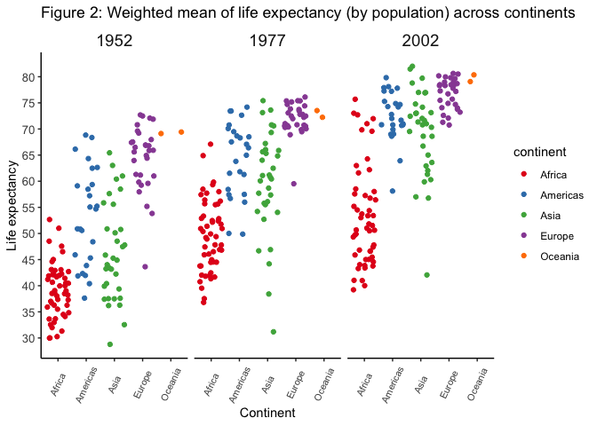

STAT545\_hw05\_exploration
================

``` r
library(gapminder)
library(tidyverse)
```

    ## ── Attaching packages ─────────────────────────────────────────────────────────── tidyverse 1.2.1 ──

    ## ✔ ggplot2 3.0.0     ✔ purrr   0.2.5
    ## ✔ tibble  1.4.2     ✔ dplyr   0.7.6
    ## ✔ tidyr   0.8.1     ✔ stringr 1.3.1
    ## ✔ readr   1.1.1     ✔ forcats 0.3.0

    ## ── Conflicts ────────────────────────────────────────────────────────────── tidyverse_conflicts() ──
    ## ✖ dplyr::filter() masks stats::filter()
    ## ✖ dplyr::lag()    masks stats::lag()

``` r
library(plotly)
```

    ## 
    ## Attaching package: 'plotly'

    ## The following object is masked from 'package:ggplot2':
    ## 
    ##     last_plot

    ## The following object is masked from 'package:stats':
    ## 
    ##     filter

    ## The following object is masked from 'package:graphics':
    ## 
    ##     layout

``` r
library(scales)
```

    ## 
    ## Attaching package: 'scales'

    ## The following object is masked from 'package:purrr':
    ## 
    ##     discard

    ## The following object is masked from 'package:readr':
    ## 
    ##     col_factor

``` r
library(RColorBrewer)
```

# Part 1: Factor management

Let’s compare the use of `filter()` vs `droplevels()` upon removing
“Oceania” from the gapminder data set.

``` r
gap_filter <- gapminder %>% 
  filter(continent != "Oceania")

gap_drop <- gap_filter %>% 
  droplevels()

str(gapminder)
```

    ## Classes 'tbl_df', 'tbl' and 'data.frame':    1704 obs. of  6 variables:
    ##  $ country  : Factor w/ 142 levels "Afghanistan",..: 1 1 1 1 1 1 1 1 1 1 ...
    ##  $ continent: Factor w/ 5 levels "Africa","Americas",..: 3 3 3 3 3 3 3 3 3 3 ...
    ##  $ year     : int  1952 1957 1962 1967 1972 1977 1982 1987 1992 1997 ...
    ##  $ lifeExp  : num  28.8 30.3 32 34 36.1 ...
    ##  $ pop      : int  8425333 9240934 10267083 11537966 13079460 14880372 12881816 13867957 16317921 22227415 ...
    ##  $ gdpPercap: num  779 821 853 836 740 ...

``` r
str(gap_filter)
```

    ## Classes 'tbl_df', 'tbl' and 'data.frame':    1680 obs. of  6 variables:
    ##  $ country  : Factor w/ 142 levels "Afghanistan",..: 1 1 1 1 1 1 1 1 1 1 ...
    ##  $ continent: Factor w/ 5 levels "Africa","Americas",..: 3 3 3 3 3 3 3 3 3 3 ...
    ##  $ year     : int  1952 1957 1962 1967 1972 1977 1982 1987 1992 1997 ...
    ##  $ lifeExp  : num  28.8 30.3 32 34 36.1 ...
    ##  $ pop      : int  8425333 9240934 10267083 11537966 13079460 14880372 12881816 13867957 16317921 22227415 ...
    ##  $ gdpPercap: num  779 821 853 836 740 ...

``` r
str(gap_drop)
```

    ## Classes 'tbl_df', 'tbl' and 'data.frame':    1680 obs. of  6 variables:
    ##  $ country  : Factor w/ 140 levels "Afghanistan",..: 1 1 1 1 1 1 1 1 1 1 ...
    ##  $ continent: Factor w/ 4 levels "Africa","Americas",..: 3 3 3 3 3 3 3 3 3 3 ...
    ##  $ year     : int  1952 1957 1962 1967 1972 1977 1982 1987 1992 1997 ...
    ##  $ lifeExp  : num  28.8 30.3 32 34 36.1 ...
    ##  $ pop      : int  8425333 9240934 10267083 11537966 13079460 14880372 12881816 13867957 16317921 22227415 ...
    ##  $ gdpPercap: num  779 821 853 836 740 ...

*Comments:* Use of `filter()` does not effect a change in the number of
levels in country (142) or continent (5) factors, whereas `droplevels()`
displays only the observed levels in country (140) and continent (4)
factors. As expected, the dropped level in continent is “Oceania”;
correspondingly, the dropped levels in country are “Australia” and “New
Zealand”.

Next, let’s compare the use of `arrange()` and `fct_reorder()` to
reorganize continent by GDP per capita.

``` r
#With arrange()
gap_A <- gap_drop %>% 
  arrange(continent, gdpPercap)

#Reordered factors
gap_R <- gap_drop %>% 
  mutate(continent = fct_reorder(continent, gdpPercap, .fun = max))

#Reordered factors and with arrange()
gap_RA <- gap_R %>% 
  arrange(continent, gdpPercap)


head(gap_drop)
```

    ## # A tibble: 6 x 6
    ##   country     continent  year lifeExp      pop gdpPercap
    ##   <fct>       <fct>     <int>   <dbl>    <int>     <dbl>
    ## 1 Afghanistan Asia       1952    28.8  8425333      779.
    ## 2 Afghanistan Asia       1957    30.3  9240934      821.
    ## 3 Afghanistan Asia       1962    32.0 10267083      853.
    ## 4 Afghanistan Asia       1967    34.0 11537966      836.
    ## 5 Afghanistan Asia       1972    36.1 13079460      740.
    ## 6 Afghanistan Asia       1977    38.4 14880372      786.

``` r
head(gap_A)
```

    ## # A tibble: 6 x 6
    ##   country          continent  year lifeExp      pop gdpPercap
    ##   <fct>            <fct>     <int>   <dbl>    <int>     <dbl>
    ## 1 Congo, Dem. Rep. Africa     2002    45.0 55379852      241.
    ## 2 Congo, Dem. Rep. Africa     2007    46.5 64606759      278.
    ## 3 Lesotho          Africa     1952    42.1   748747      299.
    ## 4 Guinea-Bissau    Africa     1952    32.5   580653      300.
    ## 5 Congo, Dem. Rep. Africa     1997    42.6 47798986      312.
    ## 6 Eritrea          Africa     1952    35.9  1438760      329.

``` r
head(gap_R)
```

    ## # A tibble: 6 x 6
    ##   country     continent  year lifeExp      pop gdpPercap
    ##   <fct>       <fct>     <int>   <dbl>    <int>     <dbl>
    ## 1 Afghanistan Asia       1952    28.8  8425333      779.
    ## 2 Afghanistan Asia       1957    30.3  9240934      821.
    ## 3 Afghanistan Asia       1962    32.0 10267083      853.
    ## 4 Afghanistan Asia       1967    34.0 11537966      836.
    ## 5 Afghanistan Asia       1972    36.1 13079460      740.
    ## 6 Afghanistan Asia       1977    38.4 14880372      786.

``` r
head(gap_RA)
```

    ## # A tibble: 6 x 6
    ##   country          continent  year lifeExp      pop gdpPercap
    ##   <fct>            <fct>     <int>   <dbl>    <int>     <dbl>
    ## 1 Congo, Dem. Rep. Africa     2002    45.0 55379852      241.
    ## 2 Congo, Dem. Rep. Africa     2007    46.5 64606759      278.
    ## 3 Lesotho          Africa     1952    42.1   748747      299.
    ## 4 Guinea-Bissau    Africa     1952    32.5   580653      300.
    ## 5 Congo, Dem. Rep. Africa     1997    42.6 47798986      312.
    ## 6 Eritrea          Africa     1952    35.9  1438760      329.

``` r
levels(gap_drop$continent)
```

    ## [1] "Africa"   "Americas" "Asia"     "Europe"

``` r
levels(gap_A$continent)
```

    ## [1] "Africa"   "Americas" "Asia"     "Europe"

``` r
levels(gap_R$continent)
```

    ## [1] "Africa"   "Americas" "Europe"   "Asia"

``` r
levels(gap_RA$continent)
```

    ## [1] "Africa"   "Americas" "Europe"   "Asia"

*Comments:* In the head of the tables displayed above, it is seen that
the use of `arrange()` reorganizes GDP per capita in ascending order
within each continent grouping. The use of `fct_reorder()` has no
observable effect on the table itself. The use of both functions leads
only to the observable effects of `arrange()`.

Usings `levels()` to check the factor levels, there is no difference
after using `arrange()`. After `fct_reorder()`, the order of the factors
changes. In this case, Europe has the second highest maximum, so
`fct_reorder()` has changed its position accordingly from the default
alphabetical ordering of contient factors.

Let’s check the
plots:

``` r
gap_drop %>% ggplot(aes(continent, gdpPercap)) + geom_boxplot() + scale_y_log10()
```

<!-- -->

``` r
gap_A %>% ggplot(aes(continent, gdpPercap)) + geom_boxplot() + scale_y_log10()
```

<!-- -->

``` r
gap_R %>% ggplot(aes(continent, gdpPercap)) + geom_boxplot() + scale_y_log10()
```

<!-- -->

``` r
gap_RA %>% ggplot(aes(continent, gdpPercap)) + geom_boxplot() + scale_y_log10()
```

<!-- -->

*Comments:* The use of `arrange()` only operates on the table output and
has no effect on the plot. This makes sense intuitively, as the data
points are still the same and thus the plot output will be the same, so
long as the grouping is still by continent and plotted against GDP per
capita. The use of `fct_reorder()` on the other hand does lead to an
observable difference in the plot. Here, I called the function to
reorder by the summary statistic maximum, so that the boxplot is
arranged in order of increasing maxima. The ordering of the factors is
the same as that observed using `levels()` above.

# Part 2: Files I/O

Let’s output gap\_RA tibble to a CSV file and then read it back in
again.

``` r
write_csv(gap_RA, "gap_RA.csv")

check_gap_RA <- read_csv("gap_RA.csv")
```

    ## Parsed with column specification:
    ## cols(
    ##   country = col_character(),
    ##   continent = col_character(),
    ##   year = col_integer(),
    ##   lifeExp = col_double(),
    ##   pop = col_integer(),
    ##   gdpPercap = col_double()
    ## )

``` r
head(gap_RA)
```

    ## # A tibble: 6 x 6
    ##   country          continent  year lifeExp      pop gdpPercap
    ##   <fct>            <fct>     <int>   <dbl>    <int>     <dbl>
    ## 1 Congo, Dem. Rep. Africa     2002    45.0 55379852      241.
    ## 2 Congo, Dem. Rep. Africa     2007    46.5 64606759      278.
    ## 3 Lesotho          Africa     1952    42.1   748747      299.
    ## 4 Guinea-Bissau    Africa     1952    32.5   580653      300.
    ## 5 Congo, Dem. Rep. Africa     1997    42.6 47798986      312.
    ## 6 Eritrea          Africa     1952    35.9  1438760      329.

``` r
head(check_gap_RA)
```

    ## # A tibble: 6 x 6
    ##   country          continent  year lifeExp      pop gdpPercap
    ##   <chr>            <chr>     <int>   <dbl>    <int>     <dbl>
    ## 1 Congo, Dem. Rep. Africa     2002    45.0 55379852      241.
    ## 2 Congo, Dem. Rep. Africa     2007    46.5 64606759      278.
    ## 3 Lesotho          Africa     1952    42.1   748747      299.
    ## 4 Guinea-Bissau    Africa     1952    32.5   580653      300.
    ## 5 Congo, Dem. Rep. Africa     1997    42.6 47798986      312.
    ## 6 Eritrea          Africa     1952    35.9  1438760      329.

*Comments:* The head of gap\_RA and the newly read-in CSV stored in
check\_gap\_RA look to be the same. Success\!

# Part 2: Visualization design

*Preamble:* Let’s revisit a plot made using `ggplot` from a previous
assignment and make it even better. I have chosen to use the following
plot: Weighted mean of life expectancy (by population) across
continents.

``` r
#Set up parameters of the plot by finding the weighted mean by population, and then storing in a new tibble, A.
A <- gapminder %>% 
      filter(year == 1952 | year == 2002 | year == 1977) %>% 
      group_by(continent, country, year) %>% #Grouping by year in order to facet plot later
      mutate(wm = round(weighted.mean(lifeExp, pop, na.rm = FALSE), digits = 1)) %>% 
      transmute(lifeExp, pop, wm) #transmute removes all columns other than the ones specified

#Create a ggplot (this is the original)

P <- ggplot(A, aes(x = continent, y = wm, color = continent)) +
  geom_jitter(alpha = 0.5) + 
  labs(title = "Figure 2: Weighted mean of life expectancy (by population) across continents", 
       x = "Continent", y = "Life expectancy") +
  facet_grid(.~year)

P
```

<!-- -->

``` r
#Create an improved ggplot

P_new <- ggplot(A, aes(x = continent, y = wm, color = continent)) +
  geom_jitter() + 
  labs(title = "Figure 2: Weighted mean of life expectancy (by population) across continents", 
       x = "Continent", y = "Life expectancy") + #Add title and axis labels
  facet_grid(.~year) +
  theme_classic() +
  theme(axis.text.x  = element_text(angle=65, vjust=0.5, size=8),
        axis.text = element_text(size = 10),
        strip.background = element_rect(colour = "white"),
        strip.text = element_text(size = 14)
        ) + #modify text labels and other plot elements
  scale_y_continuous(breaks = 1:20 * 5) + #set y-axis numbering
  scale_colour_brewer(palette = "Set1") #set color scheme

P_new
```

<!-- -->

``` r
#Convert this to a `plotly` plot:
 
ggplotly(P_new)
```

<!--html_preserve-->

<div id="htmlwidget-78ba378edc23b16a8987" class="plotly html-widget" style="width:672px;height:480px;">

</div>

<script type="application/json" data-for="htmlwidget-78ba378edc23b16a8987">{"x":{"data":[{"x":[0.870405600778759,1.01506583914161,1.28722826614976,1.35659838467836,1.02902644444257,0.701225879602134,1.13800773322582,0.928951364383101,1.39934066198766,0.827605424635112,1.10527087170631,0.889708301238716,1.29100134577602,1.01700151860714,1.06487748138607,0.68424196280539,0.822075455449522,0.793204824626446,1.25206797067076,0.876986127905548,0.647459523007274,1.14246894773096,1.26454024091363,1.03008598666638,0.672363097779453,1.01347870454192,0.801306056790054,1.25421078111976,1.32823534756899,0.793843012303114,1.053722207807,1.22478659059852,1.01097455881536,1.2150009997189,0.926713773980737,0.96533679459244,0.789428214356303,0.943060348555446,0.629543102905154,1.19578981585801,0.967835097014904,1.1148466931656,1.35082560610026,1.3592686323449,0.851964300125837,1.32850762587041,0.660711501352489,0.978820031508803,1.12337206173688,1.24748940728605,1.00792070161551,1.14311389122158],"y":[43.0735814320855,29.9865185713582,38.2311420023814,47.6325861770846,32.0108237731643,38.9601294553652,38.4643728096224,35.5170016140677,38.0981609526649,40.710461038854,39.0769972955808,42.0792309742235,40.5179860320315,34.835458310917,41.8956845148653,34.4685786053725,35.9125282169133,34.0985787134804,36.9868279891275,29.9952074672841,43.0656566684693,33.5733410614356,32.4969558824971,42.2943753529899,42.1104232185334,38.490725638438,42.7272167752124,36.7375863568857,36.3344803852215,33.7058367748372,40.4614110741764,51.0048646713234,42.9333792890981,31.3086798358522,41.6987925421447,37.3791636351123,36.2852142660506,52.7275845064409,39.9733462802693,46.4826781185903,37.2739678873494,30.3306773897447,32.9683804553375,44.9969573538564,38.5610721918009,41.3924027253129,41.1929378297553,38.5723994875699,44.6287262525037,39.9716836256161,42.0259414269589,48.5074552870542],"text":["continent: Africa<br />wm: 43.1<br />continent: Africa","continent: Africa<br />wm: 30.0<br />continent: Africa","continent: Africa<br />wm: 38.2<br />continent: Africa","continent: Africa<br />wm: 47.6<br />continent: Africa","continent: Africa<br />wm: 32.0<br />continent: Africa","continent: Africa<br />wm: 39.0<br />continent: Africa","continent: Africa<br />wm: 38.5<br />continent: Africa","continent: Africa<br />wm: 35.5<br />continent: Africa","continent: Africa<br />wm: 38.1<br />continent: Africa","continent: Africa<br />wm: 40.7<br />continent: Africa","continent: Africa<br />wm: 39.1<br />continent: Africa","continent: Africa<br />wm: 42.1<br />continent: Africa","continent: Africa<br />wm: 40.5<br />continent: Africa","continent: Africa<br />wm: 34.8<br />continent: Africa","continent: Africa<br />wm: 41.9<br />continent: Africa","continent: Africa<br />wm: 34.5<br />continent: Africa","continent: Africa<br />wm: 35.9<br />continent: Africa","continent: Africa<br />wm: 34.1<br />continent: Africa","continent: Africa<br />wm: 37.0<br />continent: Africa","continent: Africa<br />wm: 30.0<br />continent: Africa","continent: Africa<br />wm: 43.1<br />continent: Africa","continent: Africa<br />wm: 33.6<br />continent: Africa","continent: Africa<br />wm: 32.5<br />continent: Africa","continent: Africa<br />wm: 42.3<br />continent: Africa","continent: Africa<br />wm: 42.1<br />continent: Africa","continent: Africa<br />wm: 38.5<br />continent: Africa","continent: Africa<br />wm: 42.7<br />continent: Africa","continent: Africa<br />wm: 36.7<br />continent: Africa","continent: Africa<br />wm: 36.3<br />continent: Africa","continent: Africa<br />wm: 33.7<br />continent: Africa","continent: Africa<br />wm: 40.5<br />continent: Africa","continent: Africa<br />wm: 51.0<br />continent: Africa","continent: Africa<br />wm: 42.9<br />continent: Africa","continent: Africa<br />wm: 31.3<br />continent: Africa","continent: Africa<br />wm: 41.7<br />continent: Africa","continent: Africa<br />wm: 37.4<br />continent: Africa","continent: Africa<br />wm: 36.3<br />continent: Africa","continent: Africa<br />wm: 52.7<br />continent: Africa","continent: Africa<br />wm: 40.0<br />continent: Africa","continent: Africa<br />wm: 46.5<br />continent: Africa","continent: Africa<br />wm: 37.3<br />continent: Africa","continent: Africa<br />wm: 30.3<br />continent: Africa","continent: Africa<br />wm: 33.0<br />continent: Africa","continent: Africa<br />wm: 45.0<br />continent: Africa","continent: Africa<br />wm: 38.6<br />continent: Africa","continent: Africa<br />wm: 41.4<br />continent: Africa","continent: Africa<br />wm: 41.2<br />continent: Africa","continent: Africa<br />wm: 38.6<br />continent: Africa","continent: Africa<br />wm: 44.6<br />continent: Africa","continent: Africa<br />wm: 40.0<br />continent: Africa","continent: Africa<br />wm: 42.0<br />continent: Africa","continent: Africa<br />wm: 48.5<br />continent: Africa"],"type":"scatter","mode":"markers","marker":{"autocolorscale":false,"color":"rgba(228,26,28,1)","opacity":1,"size":5.66929133858268,"symbol":"circle","line":{"width":1.88976377952756,"color":"rgba(228,26,28,1)"}},"hoveron":"points","name":"Africa","legendgroup":"Africa","showlegend":true,"xaxis":"x","yaxis":"y","hoverinfo":"text","frame":null},{"x":[1.36266324371099,0.669985851831734,0.802936583943665,0.779611504636705,1.26503705531359,0.941039715707302,1.10511826332659,0.959183231927454,0.902062329277396,0.856777464039624,1.20610816031694,1.17356517184526,0.954906729236245,1.28448887430131,1.05117557737976,1.10298386849463,1.28362792879343,1.17334700096399,1.14741634186357,0.806205060333014,1.18397657126188,1.24504336658865,1.36773763429374,0.83595115467906,1.25896934978664,1.18583365734667,0.746136279776692,0.892177344299853,1.14845977909863,0.633131686784327,1.13610695730895,0.949963475205004,1.09532004911453,1.05023182239383,1.37647279631346,0.712567967362702,1.12190188746899,0.839136762358248,1.2150957826525,1.38758956827223,1.27745082005858,1.03636232260615,0.688617640733719,0.871483629569411,0.692516785115004,1.05093848276883,0.679426845908165,1.17477931939065,0.75662756729871,0.899590371735394,0.612511888518929,0.851300090923905],"y":[58.036808733847,39.5059178562649,49.2047694287822,59.2820559506305,46.1045555393584,45.8780487795733,49.3983647178113,46.7681173608825,47.4390117942914,50.9214406388625,47.8178415251896,55.5945474866778,52.4372594932094,46.4660888309777,53.3232293050922,42.0315387109295,44.4843152933568,44.4920776068978,52.8246379455924,41.7939885020815,51.7779001464322,40.7896947906539,37.4727024041489,56.2160495993868,52.236649847459,43.7901633641683,57.4382429873012,46.8657116223872,43.8162658587471,41.6663968038745,50.9351813017204,64.8647496696748,55.714381799046,42.4730319727585,56.4244370899349,41.3023202095181,44.4693961645477,67.1390543672256,45.0327875220962,58.4866686770506,48.9056301628239,36.804024391342,42.0208538060077,55.521195542179,47.82504462732,52.5346772883274,49.9135183221847,52.8700936835073,59.8014055192471,50.4393813106976,51.3835373534448,57.6603112427704],"text":["continent: Africa<br />wm: 58.0<br />continent: Africa","continent: Africa<br />wm: 39.5<br />continent: Africa","continent: Africa<br />wm: 49.2<br />continent: Africa","continent: Africa<br />wm: 59.3<br />continent: Africa","continent: Africa<br />wm: 46.1<br />continent: Africa","continent: Africa<br />wm: 45.9<br />continent: Africa","continent: Africa<br />wm: 49.4<br />continent: Africa","continent: Africa<br />wm: 46.8<br />continent: Africa","continent: Africa<br />wm: 47.4<br />continent: Africa","continent: Africa<br />wm: 50.9<br />continent: Africa","continent: Africa<br />wm: 47.8<br />continent: Africa","continent: Africa<br />wm: 55.6<br />continent: Africa","continent: Africa<br />wm: 52.4<br />continent: Africa","continent: Africa<br />wm: 46.5<br />continent: Africa","continent: Africa<br />wm: 53.3<br />continent: Africa","continent: Africa<br />wm: 42.0<br />continent: Africa","continent: Africa<br />wm: 44.5<br />continent: Africa","continent: Africa<br />wm: 44.5<br />continent: Africa","continent: Africa<br />wm: 52.8<br />continent: Africa","continent: Africa<br />wm: 41.8<br />continent: Africa","continent: Africa<br />wm: 51.8<br />continent: Africa","continent: Africa<br />wm: 40.8<br />continent: Africa","continent: Africa<br />wm: 37.5<br />continent: Africa","continent: Africa<br />wm: 56.2<br />continent: Africa","continent: Africa<br />wm: 52.2<br />continent: Africa","continent: Africa<br />wm: 43.8<br />continent: Africa","continent: Africa<br />wm: 57.4<br />continent: Africa","continent: Africa<br />wm: 46.9<br />continent: Africa","continent: Africa<br />wm: 43.8<br />continent: Africa","continent: Africa<br />wm: 41.7<br />continent: Africa","continent: Africa<br />wm: 50.9<br />continent: Africa","continent: Africa<br />wm: 64.9<br />continent: Africa","continent: Africa<br />wm: 55.7<br />continent: Africa","continent: Africa<br />wm: 42.5<br />continent: Africa","continent: Africa<br />wm: 56.4<br />continent: Africa","continent: Africa<br />wm: 41.3<br />continent: Africa","continent: Africa<br />wm: 44.5<br />continent: Africa","continent: Africa<br />wm: 67.1<br />continent: Africa","continent: Africa<br />wm: 45.0<br />continent: Africa","continent: Africa<br />wm: 58.5<br />continent: Africa","continent: Africa<br />wm: 48.9<br />continent: Africa","continent: Africa<br />wm: 36.8<br />continent: Africa","continent: Africa<br />wm: 42.0<br />continent: Africa","continent: Africa<br />wm: 55.5<br />continent: Africa","continent: Africa<br />wm: 47.8<br />continent: Africa","continent: Africa<br />wm: 52.5<br />continent: Africa","continent: Africa<br />wm: 49.9<br />continent: Africa","continent: Africa<br />wm: 52.9<br />continent: Africa","continent: Africa<br />wm: 59.8<br />continent: Africa","continent: Africa<br />wm: 50.4<br />continent: Africa","continent: Africa<br />wm: 51.4<br />continent: Africa","continent: Africa<br />wm: 57.7<br />continent: Africa"],"type":"scatter","mode":"markers","marker":{"autocolorscale":false,"color":"rgba(228,26,28,1)","opacity":1,"size":5.66929133858268,"symbol":"circle","line":{"width":1.88976377952756,"color":"rgba(228,26,28,1)"}},"hoveron":"points","name":"Africa","legendgroup":"Africa","showlegend":false,"xaxis":"x2","yaxis":"y","hoverinfo":"text","frame":null},{"x":[1.07849168516696,0.668716469593346,0.757118491269648,1.30839816778898,0.776928152702749,0.957298232242465,1.02207252401859,0.676170284487307,0.776222505234182,0.861525154486299,0.616960311681032,1.2774992628023,1.02771621253341,0.700302354991436,0.68209929857403,1.14070833120495,0.943091452121735,1.36896828915924,1.35283352602273,0.804797057807445,0.74587138146162,0.772297654114664,1.22311613894999,0.994089497625828,0.972165276296437,0.755432212725282,0.888891333155334,1.32736684251577,0.881648474559188,1.34596973825246,1.1675473831594,0.872640354558825,1.19363485276699,1.02404895145446,1.15028721410781,0.940759325399995,1.17149781193584,0.941254427656531,0.682645554468036,0.838721771724522,1.21292344164103,0.860398277267814,0.75397858787328,1.33325511664152,0.644292727857828,1.38773831576109,0.936719701066613,1.21244926471263,1.06218099705875,1.25861315000802,1.07771125994623,1.07615889050066],"y":[70.9667034419067,41.0336163130403,54.408003226351,46.6032878112607,50.610578494519,47.4096715892479,49.928314637728,43.3024861318432,50.492600529436,63.0156178598106,45.0020136690699,53.0293470718898,46.8222864061408,53.385211843159,69.809102363158,49.2712314469181,55.2007718794234,50.6771611327119,56.7988105496019,57.9727764401771,58.483813612666,53.6743540946022,45.4838470258191,50.9751646799967,44.616956672743,43.8298918665946,72.7384947883524,57.33722560931,44.9695063231513,51.8333592662774,62.2071996556968,72.0295464489236,69.5893193683028,44.0118601384014,51.5276091391966,54.4608237915859,46.6373942909762,75.670652118288,43.3798682618327,64.292614205461,61.5789979329892,41.0088974998891,45.8648844883032,53.4004849439859,56.427953616064,43.9360670122504,49.6913902948238,57.5973860744759,72.970924250409,47.8280820024759,39.1725588176027,39.9935093025677],"text":["continent: Africa<br />wm: 71.0<br />continent: Africa","continent: Africa<br />wm: 41.0<br />continent: Africa","continent: Africa<br />wm: 54.4<br />continent: Africa","continent: Africa<br />wm: 46.6<br />continent: Africa","continent: Africa<br />wm: 50.6<br />continent: Africa","continent: Africa<br />wm: 47.4<br />continent: Africa","continent: Africa<br />wm: 49.9<br />continent: Africa","continent: Africa<br />wm: 43.3<br />continent: Africa","continent: Africa<br />wm: 50.5<br />continent: Africa","continent: Africa<br />wm: 63.0<br />continent: Africa","continent: Africa<br />wm: 45.0<br />continent: Africa","continent: Africa<br />wm: 53.0<br />continent: Africa","continent: Africa<br />wm: 46.8<br />continent: Africa","continent: Africa<br />wm: 53.4<br />continent: Africa","continent: Africa<br />wm: 69.8<br />continent: Africa","continent: Africa<br />wm: 49.3<br />continent: Africa","continent: Africa<br />wm: 55.2<br />continent: Africa","continent: Africa<br />wm: 50.7<br />continent: Africa","continent: Africa<br />wm: 56.8<br />continent: Africa","continent: Africa<br />wm: 58.0<br />continent: Africa","continent: Africa<br />wm: 58.5<br />continent: Africa","continent: Africa<br />wm: 53.7<br />continent: Africa","continent: Africa<br />wm: 45.5<br />continent: Africa","continent: Africa<br />wm: 51.0<br />continent: Africa","continent: Africa<br />wm: 44.6<br />continent: Africa","continent: Africa<br />wm: 43.8<br />continent: Africa","continent: Africa<br />wm: 72.7<br />continent: Africa","continent: Africa<br />wm: 57.3<br />continent: Africa","continent: Africa<br />wm: 45.0<br />continent: Africa","continent: Africa<br />wm: 51.8<br />continent: Africa","continent: Africa<br />wm: 62.2<br />continent: Africa","continent: Africa<br />wm: 72.0<br />continent: Africa","continent: Africa<br />wm: 69.6<br />continent: Africa","continent: Africa<br />wm: 44.0<br />continent: Africa","continent: Africa<br />wm: 51.5<br />continent: Africa","continent: Africa<br />wm: 54.5<br />continent: Africa","continent: Africa<br />wm: 46.6<br />continent: Africa","continent: Africa<br />wm: 75.7<br />continent: Africa","continent: Africa<br />wm: 43.4<br />continent: Africa","continent: Africa<br />wm: 64.3<br />continent: Africa","continent: Africa<br />wm: 61.6<br />continent: Africa","continent: Africa<br />wm: 41.0<br />continent: Africa","continent: Africa<br />wm: 45.9<br />continent: Africa","continent: Africa<br />wm: 53.4<br />continent: Africa","continent: Africa<br />wm: 56.4<br />continent: Africa","continent: Africa<br />wm: 43.9<br />continent: Africa","continent: Africa<br />wm: 49.7<br />continent: Africa","continent: Africa<br />wm: 57.6<br />continent: Africa","continent: Africa<br />wm: 73.0<br />continent: Africa","continent: Africa<br />wm: 47.8<br />continent: Africa","continent: Africa<br />wm: 39.2<br />continent: Africa","continent: Africa<br />wm: 40.0<br />continent: Africa"],"type":"scatter","mode":"markers","marker":{"autocolorscale":false,"color":"rgba(228,26,28,1)","opacity":1,"size":5.66929133858268,"symbol":"circle","line":{"width":1.88976377952756,"color":"rgba(228,26,28,1)"}},"hoveron":"points","name":"Africa","legendgroup":"Africa","showlegend":false,"xaxis":"x3","yaxis":"y","hoverinfo":"text","frame":null},{"x":[2.09669914375991,1.93032470345497,1.97314473465085,1.91635922696441,2.25192807521671,1.70338809527457,2.23746567163616,2.32927866112441,1.95944697726518,1.89277772270143,1.61298653911799,1.63329120781273,2.31398354936391,1.73635226599872,1.85705474577844,2.10352110099047,2.23696130216122,2.29896973408759,2.25374757573009,2.30997501723468,2.04594510234892,2.16485556419939,2.30034610256553,1.83355481959879,1.90315937381238],"y":[62.5217558394,40.386519257091,50.8916617167741,68.8396111959405,54.7265911461785,50.5750926374458,57.2108400921896,59.3693956732377,45.8865537403896,48.4265679823421,45.2886051734909,42.0312867765687,37.5783036425337,41.9046859253012,58.4631164503098,50.8229467402212,42.2884062200412,55.1945210283063,62.5974463252537,43.879533209689,64.3244416682981,59.0650034147315,68.3648769438453,66.1382651389204,55.0879549272917],"text":["continent: Americas<br />wm: 62.5<br />continent: Americas","continent: Americas<br />wm: 40.4<br />continent: Americas","continent: Americas<br />wm: 50.9<br />continent: Americas","continent: Americas<br />wm: 68.8<br />continent: Americas","continent: Americas<br />wm: 54.7<br />continent: Americas","continent: Americas<br />wm: 50.6<br />continent: Americas","continent: Americas<br />wm: 57.2<br />continent: Americas","continent: Americas<br />wm: 59.4<br />continent: Americas","continent: Americas<br />wm: 45.9<br />continent: Americas","continent: Americas<br />wm: 48.4<br />continent: Americas","continent: Americas<br />wm: 45.3<br />continent: Americas","continent: Americas<br />wm: 42.0<br />continent: Americas","continent: Americas<br />wm: 37.6<br />continent: Americas","continent: Americas<br />wm: 41.9<br />continent: Americas","continent: Americas<br />wm: 58.5<br />continent: Americas","continent: Americas<br />wm: 50.8<br />continent: Americas","continent: Americas<br />wm: 42.3<br />continent: Americas","continent: Americas<br />wm: 55.2<br />continent: Americas","continent: Americas<br />wm: 62.6<br />continent: Americas","continent: Americas<br />wm: 43.9<br />continent: Americas","continent: Americas<br />wm: 64.3<br />continent: Americas","continent: Americas<br />wm: 59.1<br />continent: Americas","continent: Americas<br />wm: 68.4<br />continent: Americas","continent: Americas<br />wm: 66.1<br />continent: Americas","continent: Americas<br />wm: 55.1<br />continent: Americas"],"type":"scatter","mode":"markers","marker":{"autocolorscale":false,"color":"rgba(55,126,184,1)","opacity":1,"size":5.66929133858268,"symbol":"circle","line":{"width":1.88976377952756,"color":"rgba(55,126,184,1)"}},"hoveron":"points","name":"Americas","legendgroup":"Americas","showlegend":true,"xaxis":"x","yaxis":"y","hoverinfo":"text","frame":null},{"x":[2.00470043346286,2.2765673674643,2.23858095984906,1.65313643421978,2.19188576601446,2.3474834445864,1.63308983594179,2.30943951681256,2.09957298226655,1.77638249918818,2.18640740513802,2.24596142098308,2.24925913680345,2.24047942850739,2.02110298778862,2.29076748620719,2.21103891395032,2.13807591926306,2.29370743017644,2.11195505727082,1.90428145825863,1.86909781787544,1.901660704799,2.30348101891577,2.20618788655847],"y":[68.510694220718,50.0392337237485,61.522734950576,74.2347887693159,67.0886346908845,63.8017377644032,70.7805799213797,72.6202233601734,61.7726422015391,61.2943212477118,56.6691714111902,55.9957896765321,49.9041641129926,57.432306886632,70.1227245194279,65.0200192019343,57.5329752289504,68.7228208209761,66.4313510795496,58.3863657457195,73.3795428185165,68.3394274193607,73.4014813729376,69.4799625763111,67.5302733946778],"text":["continent: Americas<br />wm: 68.5<br />continent: Americas","continent: Americas<br />wm: 50.0<br />continent: Americas","continent: Americas<br />wm: 61.5<br />continent: Americas","continent: Americas<br />wm: 74.2<br />continent: Americas","continent: Americas<br />wm: 67.1<br />continent: Americas","continent: Americas<br />wm: 63.8<br />continent: Americas","continent: Americas<br />wm: 70.8<br />continent: Americas","continent: Americas<br />wm: 72.6<br />continent: Americas","continent: Americas<br />wm: 61.8<br />continent: Americas","continent: Americas<br />wm: 61.3<br />continent: Americas","continent: Americas<br />wm: 56.7<br />continent: Americas","continent: Americas<br />wm: 56.0<br />continent: Americas","continent: Americas<br />wm: 49.9<br />continent: Americas","continent: Americas<br />wm: 57.4<br />continent: Americas","continent: Americas<br />wm: 70.1<br />continent: Americas","continent: Americas<br />wm: 65.0<br />continent: Americas","continent: Americas<br />wm: 57.5<br />continent: Americas","continent: Americas<br />wm: 68.7<br />continent: Americas","continent: Americas<br />wm: 66.4<br />continent: Americas","continent: Americas<br />wm: 58.4<br />continent: Americas","continent: Americas<br />wm: 73.4<br />continent: Americas","continent: Americas<br />wm: 68.3<br />continent: Americas","continent: Americas<br />wm: 73.4<br />continent: Americas","continent: Americas<br />wm: 69.5<br />continent: Americas","continent: Americas<br />wm: 67.5<br />continent: Americas"],"type":"scatter","mode":"markers","marker":{"autocolorscale":false,"color":"rgba(55,126,184,1)","opacity":1,"size":5.66929133858268,"symbol":"circle","line":{"width":1.88976377952756,"color":"rgba(55,126,184,1)"}},"hoveron":"points","name":"Americas","legendgroup":"Americas","showlegend":false,"xaxis":"x2","yaxis":"y","hoverinfo":"text","frame":null},{"x":[2.15083599574864,2.37413160800934,2.04529830869287,1.62623257432133,2.1538387613371,1.7643414599821,1.92713265884668,2.12268657721579,1.92380665857345,1.84316743835807,1.94236333314329,1.84491468891501,1.65607289038599,2.24781440552324,1.91460615452379,2.00270539987832,1.8399019818753,2.16646381635219,2.39099997915328,2.00342877935618,2.38830783478916,2.13676606696099,1.67581439726055,1.95531379431486,2.26200919486582],"y":[74.2919172940962,63.8974612719193,70.9601787721366,79.8217310242355,77.8636957565509,71.7321022632532,78.1226606883109,77.2044471317157,70.8078961151093,74.1884155664034,70.730403000135,69.0248332543485,58.0795148477145,68.5803832733259,71.9778071480058,74.8738739919476,70.8295865062624,74.6765721052885,70.7782159496285,69.9196657505632,77.8067680250667,68.9857671571709,77.329618733935,75.3331014641561,72.7797104157321],"text":["continent: Americas<br />wm: 74.3<br />continent: Americas","continent: Americas<br />wm: 63.9<br />continent: Americas","continent: Americas<br />wm: 71.0<br />continent: Americas","continent: Americas<br />wm: 79.8<br />continent: Americas","continent: Americas<br />wm: 77.9<br />continent: Americas","continent: Americas<br />wm: 71.7<br />continent: Americas","continent: Americas<br />wm: 78.1<br />continent: Americas","continent: Americas<br />wm: 77.2<br />continent: Americas","continent: Americas<br />wm: 70.8<br />continent: Americas","continent: Americas<br />wm: 74.2<br />continent: Americas","continent: Americas<br />wm: 70.7<br />continent: Americas","continent: Americas<br />wm: 69.0<br />continent: Americas","continent: Americas<br />wm: 58.1<br />continent: Americas","continent: Americas<br />wm: 68.6<br />continent: Americas","continent: Americas<br />wm: 72.0<br />continent: Americas","continent: Americas<br />wm: 74.9<br />continent: Americas","continent: Americas<br />wm: 70.8<br />continent: Americas","continent: Americas<br />wm: 74.7<br />continent: Americas","continent: Americas<br />wm: 70.8<br />continent: Americas","continent: Americas<br />wm: 69.9<br />continent: Americas","continent: Americas<br />wm: 77.8<br />continent: Americas","continent: Americas<br />wm: 69.0<br />continent: Americas","continent: Americas<br />wm: 77.3<br />continent: Americas","continent: Americas<br />wm: 75.3<br />continent: Americas","continent: Americas<br />wm: 72.8<br />continent: Americas"],"type":"scatter","mode":"markers","marker":{"autocolorscale":false,"color":"rgba(55,126,184,1)","opacity":1,"size":5.66929133858268,"symbol":"circle","line":{"width":1.88976377952756,"color":"rgba(55,126,184,1)"}},"hoveron":"points","name":"Americas","legendgroup":"Americas","showlegend":false,"xaxis":"x3","yaxis":"y","hoverinfo":"text","frame":null},{"x":[3.13594625201076,3.27221120558679,3.17902378533036,2.82949045803398,2.88793470729142,2.65576576124877,3.03530061189085,3.35856697801501,3.33472351972014,3.31602310892195,3.28586756978184,2.8238497916609,2.83213242664933,2.96215438004583,2.72794914655387,3.02477273978293,2.71628499291837,3.14794634915888,3.0860123179853,3.36801169104874,3.10750035382807,3.29332441110164,2.61977310441434,2.635412324965,3.01404727492481,2.73455363009125,3.35587311461568,2.78588930293918,3.13011146262288,2.71677404325455,2.69166194610298,3.13571396041662,3.30958715509623],"y":[28.7876910106093,50.8806975533441,37.5354383531958,39.4321663866565,44.0104056647047,61.0382556432486,37.4159703178518,37.5326661333814,44.9161815875024,45.3079504897259,65.4244935197197,62.9988656055555,43.2335762727447,50.1248541991785,47.5229487621784,55.5687976699881,55.8671839530021,48.4716593604535,42.195203224346,36.2830552852713,36.2346247293986,37.5841507356986,43.4308910624124,47.8021596575528,39.8925565702096,60.4258005882427,57.5614618137479,45.8716334975697,58.485794579424,50.7740997434407,40.3785248327441,43.1712040959112,32.5129919351637],"text":["continent: Asia<br />wm: 28.8<br />continent: Asia","continent: Asia<br />wm: 50.9<br />continent: Asia","continent: Asia<br />wm: 37.5<br />continent: Asia","continent: Asia<br />wm: 39.4<br />continent: Asia","continent: Asia<br />wm: 44.0<br />continent: Asia","continent: Asia<br />wm: 61.0<br />continent: Asia","continent: Asia<br />wm: 37.4<br />continent: Asia","continent: Asia<br />wm: 37.5<br />continent: Asia","continent: Asia<br />wm: 44.9<br />continent: Asia","continent: Asia<br />wm: 45.3<br />continent: Asia","continent: Asia<br />wm: 65.4<br />continent: Asia","continent: Asia<br />wm: 63.0<br />continent: Asia","continent: Asia<br />wm: 43.2<br />continent: Asia","continent: Asia<br />wm: 50.1<br />continent: Asia","continent: Asia<br />wm: 47.5<br />continent: Asia","continent: Asia<br />wm: 55.6<br />continent: Asia","continent: Asia<br />wm: 55.9<br />continent: Asia","continent: Asia<br />wm: 48.5<br />continent: Asia","continent: Asia<br />wm: 42.2<br />continent: Asia","continent: Asia<br />wm: 36.3<br />continent: Asia","continent: Asia<br />wm: 36.2<br />continent: Asia","continent: Asia<br />wm: 37.6<br />continent: Asia","continent: Asia<br />wm: 43.4<br />continent: Asia","continent: Asia<br />wm: 47.8<br />continent: Asia","continent: Asia<br />wm: 39.9<br />continent: Asia","continent: Asia<br />wm: 60.4<br />continent: Asia","continent: Asia<br />wm: 57.6<br />continent: Asia","continent: Asia<br />wm: 45.9<br />continent: Asia","continent: Asia<br />wm: 58.5<br />continent: Asia","continent: Asia<br />wm: 50.8<br />continent: Asia","continent: Asia<br />wm: 40.4<br />continent: Asia","continent: Asia<br />wm: 43.2<br />continent: Asia","continent: Asia<br />wm: 32.5<br />continent: Asia"],"type":"scatter","mode":"markers","marker":{"autocolorscale":false,"color":"rgba(77,175,74,1)","opacity":1,"size":5.66929133858268,"symbol":"circle","line":{"width":1.88976377952756,"color":"rgba(77,175,74,1)"}},"hoveron":"points","name":"Asia","legendgroup":"Asia","showlegend":true,"xaxis":"x","yaxis":"y","hoverinfo":"text","frame":null},{"x":[2.66928780041635,2.88270809911191,3.14055902846158,3.30326591040939,3.10517669897526,3.16467249784619,3.29000868201256,3.32411783393472,3.29250908531249,2.90159266665578,3.15924240387976,2.90189802590758,2.92734335437417,2.62261883225292,3.17997967023402,3.34920315444469,2.80917098354548,3.25233094617724,3.195366464369,3.38038518875837,2.8237247530371,2.65654333420098,3.30259724315256,2.87891034893692,2.66317862533033,2.68214547913522,3.03249590992928,2.96110951341689,2.96622147299349,3.2412686323747,2.86635634656996,3.11766032576561,2.62867221105844],"y":[38.4201046903804,65.5923627369851,46.9170868540369,31.1845802977495,64.0102058680356,73.5746606192924,54.2027899912186,52.6864006393217,57.6918317778781,60.3649234457687,73.0668160711043,75.4347600043565,61.1219370848127,67.2226910740696,64.7649746699631,69.3059389377013,66.1114318290539,65.3104338712059,55.5306108752824,56.1242048315518,46.7389248079248,57.3934613249078,53.9863355201669,60.0789372056164,58.6822685960494,70.7791911696829,65.8919208560884,61.1698449514993,70.6115584411845,62.531009161137,55.7888216641918,60.764365307726,44.195414976012],"text":["continent: Asia<br />wm: 38.4<br />continent: Asia","continent: Asia<br />wm: 65.6<br />continent: Asia","continent: Asia<br />wm: 46.9<br />continent: Asia","continent: Asia<br />wm: 31.2<br />continent: Asia","continent: Asia<br />wm: 64.0<br />continent: Asia","continent: Asia<br />wm: 73.6<br />continent: Asia","continent: Asia<br />wm: 54.2<br />continent: Asia","continent: Asia<br />wm: 52.7<br />continent: Asia","continent: Asia<br />wm: 57.7<br />continent: Asia","continent: Asia<br />wm: 60.4<br />continent: Asia","continent: Asia<br />wm: 73.1<br />continent: Asia","continent: Asia<br />wm: 75.4<br />continent: Asia","continent: Asia<br />wm: 61.1<br />continent: Asia","continent: Asia<br />wm: 67.2<br />continent: Asia","continent: Asia<br />wm: 64.8<br />continent: Asia","continent: Asia<br />wm: 69.3<br />continent: Asia","continent: Asia<br />wm: 66.1<br />continent: Asia","continent: Asia<br />wm: 65.3<br />continent: Asia","continent: Asia<br />wm: 55.5<br />continent: Asia","continent: Asia<br />wm: 56.1<br />continent: Asia","continent: Asia<br />wm: 46.7<br />continent: Asia","continent: Asia<br />wm: 57.4<br />continent: Asia","continent: Asia<br />wm: 54.0<br />continent: Asia","continent: Asia<br />wm: 60.1<br />continent: Asia","continent: Asia<br />wm: 58.7<br />continent: Asia","continent: Asia<br />wm: 70.8<br />continent: Asia","continent: Asia<br />wm: 65.9<br />continent: Asia","continent: Asia<br />wm: 61.2<br />continent: Asia","continent: Asia<br />wm: 70.6<br />continent: Asia","continent: Asia<br />wm: 62.5<br />continent: Asia","continent: Asia<br />wm: 55.8<br />continent: Asia","continent: Asia<br />wm: 60.8<br />continent: Asia","continent: Asia<br />wm: 44.2<br />continent: Asia"],"type":"scatter","mode":"markers","marker":{"autocolorscale":false,"color":"rgba(77,175,74,1)","opacity":1,"size":5.66929133858268,"symbol":"circle","line":{"width":1.88976377952756,"color":"rgba(77,175,74,1)"}},"hoveron":"points","name":"Asia","legendgroup":"Asia","showlegend":false,"xaxis":"x2","yaxis":"y","hoverinfo":"text","frame":null},{"x":[3.38031028285623,3.38724967744201,3.23838708791882,2.75491455290467,2.9487427663058,3.06265463996679,3.27503843531013,2.72854470126331,3.08398372177035,2.72277663089335,3.14118030685931,3.1824383514002,2.82255728542805,2.93070210888982,3.16877616979182,2.61771622411907,3.29950225055218,3.34810259602964,2.75592272151262,2.7515854999423,2.60759491343051,3.04759092722088,2.87498492151499,2.68548816088587,3.25436141677201,2.9544483602047,2.66063578687608,3.35898197256029,2.65025247149169,3.16648301556706,3.27928604688495,2.94890130758286,2.80044552516192],"y":[42.0729868699238,74.7889037823677,61.9942725575902,56.8022648786753,72.0193906144239,81.4942239616253,62.8685219344683,68.6220427140407,69.5139347166568,57.0016973187774,79.7284933331609,82.0182252781838,71.2856480944529,66.6918543362804,76.9815028149821,76.8723554654606,70.9758376004547,72.9603274436109,64.9964549429342,59.9123270223849,61.2887588862702,74.2257363077998,63.6165089535154,70.274861321114,71.5919547526352,78.7678809146769,70.7923438241147,73.1264994642511,77.0248707598075,68.5602818703651,72.9929924560524,72.3603957808763,60.2822748274915],"text":["continent: Asia<br />wm: 42.1<br />continent: Asia","continent: Asia<br />wm: 74.8<br />continent: Asia","continent: Asia<br />wm: 62.0<br />continent: Asia","continent: Asia<br />wm: 56.8<br />continent: Asia","continent: Asia<br />wm: 72.0<br />continent: Asia","continent: Asia<br />wm: 81.5<br />continent: Asia","continent: Asia<br />wm: 62.9<br />continent: Asia","continent: Asia<br />wm: 68.6<br />continent: Asia","continent: Asia<br />wm: 69.5<br />continent: Asia","continent: Asia<br />wm: 57.0<br />continent: Asia","continent: Asia<br />wm: 79.7<br />continent: Asia","continent: Asia<br />wm: 82.0<br />continent: Asia","continent: Asia<br />wm: 71.3<br />continent: Asia","continent: Asia<br />wm: 66.7<br />continent: Asia","continent: Asia<br />wm: 77.0<br />continent: Asia","continent: Asia<br />wm: 76.9<br />continent: Asia","continent: Asia<br />wm: 71.0<br />continent: Asia","continent: Asia<br />wm: 73.0<br />continent: Asia","continent: Asia<br />wm: 65.0<br />continent: Asia","continent: Asia<br />wm: 59.9<br />continent: Asia","continent: Asia<br />wm: 61.3<br />continent: Asia","continent: Asia<br />wm: 74.2<br />continent: Asia","continent: Asia<br />wm: 63.6<br />continent: Asia","continent: Asia<br />wm: 70.3<br />continent: Asia","continent: Asia<br />wm: 71.6<br />continent: Asia","continent: Asia<br />wm: 78.8<br />continent: Asia","continent: Asia<br />wm: 70.8<br />continent: Asia","continent: Asia<br />wm: 73.1<br />continent: Asia","continent: Asia<br />wm: 77.0<br />continent: Asia","continent: Asia<br />wm: 68.6<br />continent: Asia","continent: Asia<br />wm: 73.0<br />continent: Asia","continent: Asia<br />wm: 72.4<br />continent: Asia","continent: Asia<br />wm: 60.3<br />continent: Asia"],"type":"scatter","mode":"markers","marker":{"autocolorscale":false,"color":"rgba(77,175,74,1)","opacity":1,"size":5.66929133858268,"symbol":"circle","line":{"width":1.88976377952756,"color":"rgba(77,175,74,1)"}},"hoveron":"points","name":"Asia","legendgroup":"Asia","showlegend":false,"xaxis":"x3","yaxis":"y","hoverinfo":"text","frame":null},{"x":[3.79119490124285,3.99791757576168,3.80828292518854,4.18377185948193,3.94120989255607,3.61295552588999,3.82476885803044,3.81332846377045,3.70171448476613,3.62101134974509,4.17997898310423,3.80623725634068,4.16283954940736,4.16908171959221,4.11973171960562,3.74149337727577,3.94282842613757,4.21173061449081,3.99510234165937,3.61892801765352,3.6834677439183,3.71867942251265,4.1225885245949,4.28951198421419,3.94172310046852,3.66504445020109,4.35803512800485,3.90410384256393,3.9570854799822,3.79141572732478],"y":[55.2217024633661,66.8000660374202,68.0191825660504,53.801429645028,59.5922818305343,61.162948441226,66.9399500588141,70.8106300997734,66.5243994151428,67.4133341012523,67.5030489645712,65.9217540103756,63.9616630258784,72.4634846763313,66.8706422851607,65.9352282232046,59.1724431388266,72.1182481791265,72.7107235029899,61.2718253850378,59.7604252592102,60.9763736807927,57.9618835753575,64.3882195334323,65.604215825405,64.931707697697,71.8715833027288,69.581268612463,43.5914144710638,69.1730577555671],"text":["continent: Europe<br />wm: 55.2<br />continent: Europe","continent: Europe<br />wm: 66.8<br />continent: Europe","continent: Europe<br />wm: 68.0<br />continent: Europe","continent: Europe<br />wm: 53.8<br />continent: Europe","continent: Europe<br />wm: 59.6<br />continent: Europe","continent: Europe<br />wm: 61.2<br />continent: Europe","continent: Europe<br />wm: 66.9<br />continent: Europe","continent: Europe<br />wm: 70.8<br />continent: Europe","continent: Europe<br />wm: 66.5<br />continent: Europe","continent: Europe<br />wm: 67.4<br />continent: Europe","continent: Europe<br />wm: 67.5<br />continent: Europe","continent: Europe<br />wm: 65.9<br />continent: Europe","continent: Europe<br />wm: 64.0<br />continent: Europe","continent: Europe<br />wm: 72.5<br />continent: Europe","continent: Europe<br />wm: 66.9<br />continent: Europe","continent: Europe<br />wm: 65.9<br />continent: Europe","continent: Europe<br />wm: 59.2<br />continent: Europe","continent: Europe<br />wm: 72.1<br />continent: Europe","continent: Europe<br />wm: 72.7<br />continent: Europe","continent: Europe<br />wm: 61.3<br />continent: Europe","continent: Europe<br />wm: 59.8<br />continent: Europe","continent: Europe<br />wm: 61.0<br />continent: Europe","continent: Europe<br />wm: 58.0<br />continent: Europe","continent: Europe<br />wm: 64.4<br />continent: Europe","continent: Europe<br />wm: 65.6<br />continent: Europe","continent: Europe<br />wm: 64.9<br />continent: Europe","continent: Europe<br />wm: 71.9<br />continent: Europe","continent: Europe<br />wm: 69.6<br />continent: Europe","continent: Europe<br />wm: 43.6<br />continent: Europe","continent: Europe<br />wm: 69.2<br />continent: Europe"],"type":"scatter","mode":"markers","marker":{"autocolorscale":false,"color":"rgba(152,78,163,1)","opacity":1,"size":5.66929133858268,"symbol":"circle","line":{"width":1.88976377952756,"color":"rgba(152,78,163,1)"}},"hoveron":"points","name":"Europe","legendgroup":"Europe","showlegend":true,"xaxis":"x","yaxis":"y","hoverinfo":"text","frame":null},{"x":[4.35870070699602,3.77059295009822,3.85357048027217,3.88259902335703,4.37621348835528,4.01425386629999,3.90761563163251,3.68928564824164,4.35049722827971,4.1447655769065,3.82111660800874,4.35067499559373,3.65494411401451,3.98038834147155,4.11659073866904,3.94932828657329,3.83518006745726,4.16633364912123,4.01740977428854,4.32776923682541,3.75588918533176,3.91817942075431,4.23767916578799,3.65181397292763,3.86721649840474,3.76128159537911,4.09003746565431,4.39275817275047,4.03588327337056,4.16652886103839],"y":[68.8706385134906,72.1973085545935,72.7632490034401,69.9231777280755,70.7666900525428,70.6043246264569,70.687261430528,74.6813687281497,72.4679418744892,73.8084799724631,72.4844753064588,73.7224329699017,70.0379577963427,76.1390823424049,71.9908825780079,73.5181087514758,73.0955669219047,75.1697533138469,75.3730398099497,70.6911440057494,70.3630910991505,69.4841959626228,70.3081178764813,70.4614342308417,71.0201323016547,74.3872040985711,75.409212739598,75.3908270815387,59.4891073047742,72.7961900789104],"text":["continent: Europe<br />wm: 68.9<br />continent: Europe","continent: Europe<br />wm: 72.2<br />continent: Europe","continent: Europe<br />wm: 72.8<br />continent: Europe","continent: Europe<br />wm: 69.9<br />continent: Europe","continent: Europe<br />wm: 70.8<br />continent: Europe","continent: Europe<br />wm: 70.6<br />continent: Europe","continent: Europe<br />wm: 70.7<br />continent: Europe","continent: Europe<br />wm: 74.7<br />continent: Europe","continent: Europe<br />wm: 72.5<br />continent: Europe","continent: Europe<br />wm: 73.8<br />continent: Europe","continent: Europe<br />wm: 72.5<br />continent: Europe","continent: Europe<br />wm: 73.7<br />continent: Europe","continent: Europe<br />wm: 70.0<br />continent: Europe","continent: Europe<br />wm: 76.1<br />continent: Europe","continent: Europe<br />wm: 72.0<br />continent: Europe","continent: Europe<br />wm: 73.5<br />continent: Europe","continent: Europe<br />wm: 73.1<br />continent: Europe","continent: Europe<br />wm: 75.2<br />continent: Europe","continent: Europe<br />wm: 75.4<br />continent: Europe","continent: Europe<br />wm: 70.7<br />continent: Europe","continent: Europe<br />wm: 70.4<br />continent: Europe","continent: Europe<br />wm: 69.5<br />continent: Europe","continent: Europe<br />wm: 70.3<br />continent: Europe","continent: Europe<br />wm: 70.5<br />continent: Europe","continent: Europe<br />wm: 71.0<br />continent: Europe","continent: Europe<br />wm: 74.4<br />continent: Europe","continent: Europe<br />wm: 75.4<br />continent: Europe","continent: Europe<br />wm: 75.4<br />continent: Europe","continent: Europe<br />wm: 59.5<br />continent: Europe","continent: Europe<br />wm: 72.8<br />continent: Europe"],"type":"scatter","mode":"markers","marker":{"autocolorscale":false,"color":"rgba(152,78,163,1)","opacity":1,"size":5.66929133858268,"symbol":"circle","line":{"width":1.88976377952756,"color":"rgba(152,78,163,1)"}},"hoveron":"points","name":"Europe","legendgroup":"Europe","showlegend":false,"xaxis":"x2","yaxis":"y","hoverinfo":"text","frame":null},{"x":[3.99267334081233,3.63675355836749,4.12717030793428,3.99624300599098,3.66084156837314,3.96566132735461,3.90578162726015,3.98903090748936,3.73939307108521,3.65800078269094,4.1248531088233,4.3800960291177,3.70729191657156,4.31317164152861,4.00980350859463,4.01077416650951,4.03404630776495,4.12144156564027,4.04832257088274,4.33217009492219,3.87945525255054,4.30097237657756,3.6960862737149,3.89083344396204,3.82881601899862,4.3546915370971,3.79853105265647,3.79670661985874,4.321179991588,3.96889852229506],"y":[75.6654232865386,79.0107448139042,78.2774282908998,74.1336195007898,72.1361676781252,74.899977296032,75.4986284614354,77.2374180361442,78.3826027440466,79.5770245862938,78.687167280931,78.3177011407912,72.5861679355241,80.5026759200171,77.8119753785059,80.2263688666746,74.0173594587669,78.5087843395956,79.0134006519616,74.6982685290277,77.278644135911,71.2764604532719,73.2153746535629,73.818400860969,76.705297012534,79.8109783524834,80.0246163598634,80.5798961090296,70.7667907211185,78.5070057922788],"text":["continent: Europe<br />wm: 75.7<br />continent: Europe","continent: Europe<br />wm: 79.0<br />continent: Europe","continent: Europe<br />wm: 78.3<br />continent: Europe","continent: Europe<br />wm: 74.1<br />continent: Europe","continent: Europe<br />wm: 72.1<br />continent: Europe","continent: Europe<br />wm: 74.9<br />continent: Europe","continent: Europe<br />wm: 75.5<br />continent: Europe","continent: Europe<br />wm: 77.2<br />continent: Europe","continent: Europe<br />wm: 78.4<br />continent: Europe","continent: Europe<br />wm: 79.6<br />continent: Europe","continent: Europe<br />wm: 78.7<br />continent: Europe","continent: Europe<br />wm: 78.3<br />continent: Europe","continent: Europe<br />wm: 72.6<br />continent: Europe","continent: Europe<br />wm: 80.5<br />continent: Europe","continent: Europe<br />wm: 77.8<br />continent: Europe","continent: Europe<br />wm: 80.2<br />continent: Europe","continent: Europe<br />wm: 74.0<br />continent: Europe","continent: Europe<br />wm: 78.5<br />continent: Europe","continent: Europe<br />wm: 79.0<br />continent: Europe","continent: Europe<br />wm: 74.7<br />continent: Europe","continent: Europe<br />wm: 77.3<br />continent: Europe","continent: Europe<br />wm: 71.3<br />continent: Europe","continent: Europe<br />wm: 73.2<br />continent: Europe","continent: Europe<br />wm: 73.8<br />continent: Europe","continent: Europe<br />wm: 76.7<br />continent: Europe","continent: Europe<br />wm: 79.8<br />continent: Europe","continent: Europe<br />wm: 80.0<br />continent: Europe","continent: Europe<br />wm: 80.6<br />continent: Europe","continent: Europe<br />wm: 70.8<br />continent: Europe","continent: Europe<br />wm: 78.5<br />continent: Europe"],"type":"scatter","mode":"markers","marker":{"autocolorscale":false,"color":"rgba(152,78,163,1)","opacity":1,"size":5.66929133858268,"symbol":"circle","line":{"width":1.88976377952756,"color":"rgba(152,78,163,1)"}},"hoveron":"points","name":"Europe","legendgroup":"Europe","showlegend":false,"xaxis":"x3","yaxis":"y","hoverinfo":"text","frame":null},{"x":[4.73937756977975,5.14272321350873],"y":[69.1032867774367,69.3655167309381],"text":["continent: Oceania<br />wm: 69.1<br />continent: Oceania","continent: Oceania<br />wm: 69.4<br />continent: Oceania"],"type":"scatter","mode":"markers","marker":{"autocolorscale":false,"color":"rgba(255,127,0,1)","opacity":1,"size":5.66929133858268,"symbol":"circle","line":{"width":1.88976377952756,"color":"rgba(255,127,0,1)"}},"hoveron":"points","name":"Oceania","legendgroup":"Oceania","showlegend":true,"xaxis":"x","yaxis":"y","hoverinfo":"text","frame":null},{"x":[5.20725071784109,5.33632430080324],"y":[73.4631766754948,72.1871029493585],"text":["continent: Oceania<br />wm: 73.5<br />continent: Oceania","continent: Oceania<br />wm: 72.2<br />continent: Oceania"],"type":"scatter","mode":"markers","marker":{"autocolorscale":false,"color":"rgba(255,127,0,1)","opacity":1,"size":5.66929133858268,"symbol":"circle","line":{"width":1.88976377952756,"color":"rgba(255,127,0,1)"}},"hoveron":"points","name":"Oceania","legendgroup":"Oceania","showlegend":false,"xaxis":"x2","yaxis":"y","hoverinfo":"text","frame":null},{"x":[5.31806922052056,4.63114913776517],"y":[80.3807285678759,79.0820518225245],"text":["continent: Oceania<br />wm: 80.4<br />continent: Oceania","continent: Oceania<br />wm: 79.1<br />continent: Oceania"],"type":"scatter","mode":"markers","marker":{"autocolorscale":false,"color":"rgba(255,127,0,1)","opacity":1,"size":5.66929133858268,"symbol":"circle","line":{"width":1.88976377952756,"color":"rgba(255,127,0,1)"}},"hoveron":"points","name":"Oceania","legendgroup":"Oceania","showlegend":false,"xaxis":"x3","yaxis":"y","hoverinfo":"text","frame":null}],"layout":{"margin":{"t":62.3594852635948,"r":25.9028642590286,"b":71.9231828878753,"l":38.854296388543},"plot_bgcolor":"rgba(255,255,255,1)","paper_bgcolor":"rgba(255,255,255,1)","font":{"color":"rgba(0,0,0,1)","family":"","size":14.6118721461187},"title":"Figure 2: Weighted mean of life expectancy (by population) across continents","titlefont":{"color":"rgba(0,0,0,1)","family":"","size":17.5342465753425},"xaxis":{"domain":[0,0.322461404653185],"automargin":true,"type":"linear","autorange":false,"range":[0.4,5.6],"tickmode":"array","ticktext":["Africa","Americas","Asia","Europe","Oceania"],"tickvals":[1,2,3,4,5],"categoryorder":"array","categoryarray":["Africa","Americas","Asia","Europe","Oceania"],"nticks":null,"ticks":"outside","tickcolor":"rgba(51,51,51,1)","ticklen":3.65296803652968,"tickwidth":0.66417600664176,"showticklabels":true,"tickfont":{"color":"rgba(77,77,77,1)","family":"","size":10.6268161062682},"tickangle":-65,"showline":true,"linecolor":"rgba(0,0,0,1)","linewidth":0.66417600664176,"showgrid":false,"gridcolor":null,"gridwidth":0,"zeroline":false,"anchor":"y","title":"","titlefont":{"color":"rgba(0,0,0,1)","family":"","size":14.6118721461187},"hoverformat":".2f"},"annotations":[{"text":"Continent","x":0.5,"y":-0.113310283984443,"showarrow":false,"ax":0,"ay":0,"font":{"color":"rgba(0,0,0,1)","family":"","size":14.6118721461187},"xref":"paper","yref":"paper","textangle":-0,"xanchor":"center","yanchor":"top","annotationType":"axis"},{"text":"Life expectancy","x":-0.0360750360750361,"y":0.5,"showarrow":false,"ax":0,"ay":0,"font":{"color":"rgba(0,0,0,1)","family":"","size":14.6118721461187},"xref":"paper","yref":"paper","textangle":-90,"xanchor":"right","yanchor":"center","annotationType":"axis"},{"text":"1952","x":0.161230702326593,"y":1,"showarrow":false,"ax":0,"ay":0,"font":{"color":"rgba(26,26,26,1)","family":"","size":18.5969281859693},"xref":"paper","yref":"paper","textangle":-0,"xanchor":"center","yanchor":"bottom"},{"text":"1977","x":0.5,"y":1,"showarrow":false,"ax":0,"ay":0,"font":{"color":"rgba(26,26,26,1)","family":"","size":18.5969281859693},"xref":"paper","yref":"paper","textangle":-0,"xanchor":"center","yanchor":"bottom"},{"text":"2002","x":0.838769297673407,"y":1,"showarrow":false,"ax":0,"ay":0,"font":{"color":"rgba(26,26,26,1)","family":"","size":18.5969281859693},"xref":"paper","yref":"paper","textangle":-0,"xanchor":"center","yanchor":"bottom"},{"text":"continent","x":1.02,"y":1,"showarrow":false,"ax":0,"ay":0,"font":{"color":"rgba(0,0,0,1)","family":"","size":14.6118721461187},"xref":"paper","yref":"paper","textangle":-0,"xanchor":"left","yanchor":"bottom","legendTitle":true}],"yaxis":{"domain":[0,1],"automargin":true,"type":"linear","autorange":false,"range":[26.1261642972305,84.6797519915626],"tickmode":"array","ticktext":["30","35","40","45","50","55","60","65","70","75","80"],"tickvals":[30,35,40,45,50,55,60,65,70,75,80],"categoryorder":"array","categoryarray":["30","35","40","45","50","55","60","65","70","75","80"],"nticks":null,"ticks":"outside","tickcolor":"rgba(51,51,51,1)","ticklen":3.65296803652968,"tickwidth":0.66417600664176,"showticklabels":true,"tickfont":{"color":"rgba(77,77,77,1)","family":"","size":13.2835201328352},"tickangle":-0,"showline":true,"linecolor":"rgba(0,0,0,1)","linewidth":0.66417600664176,"showgrid":false,"gridcolor":null,"gridwidth":0,"zeroline":false,"anchor":"x","title":"","titlefont":{"color":"rgba(0,0,0,1)","family":"","size":14.6118721461187},"hoverformat":".2f"},"shapes":[{"type":"rect","fillcolor":null,"line":{"color":null,"width":0,"linetype":[]},"yref":"paper","xref":"paper","x0":0,"x1":0.322461404653185,"y0":0,"y1":1},{"type":"rect","fillcolor":"rgba(255,255,255,1)","line":{"color":"rgba(255,255,255,1)","width":1.32835201328352,"linetype":"solid"},"yref":"paper","xref":"paper","x0":0,"x1":0.322461404653185,"y0":0,"y1":30.2864259028643,"yanchor":1,"ysizemode":"pixel"},{"type":"rect","fillcolor":null,"line":{"color":null,"width":0,"linetype":[]},"yref":"paper","xref":"paper","x0":0.344205262013481,"x1":0.655794737986519,"y0":0,"y1":1},{"type":"rect","fillcolor":"rgba(255,255,255,1)","line":{"color":"rgba(255,255,255,1)","width":1.32835201328352,"linetype":"solid"},"yref":"paper","xref":"paper","x0":0.344205262013481,"x1":0.655794737986519,"y0":0,"y1":30.2864259028643,"yanchor":1,"ysizemode":"pixel"},{"type":"rect","fillcolor":null,"line":{"color":null,"width":0,"linetype":[]},"yref":"paper","xref":"paper","x0":0.677538595346814,"x1":1,"y0":0,"y1":1},{"type":"rect","fillcolor":"rgba(255,255,255,1)","line":{"color":"rgba(255,255,255,1)","width":1.32835201328352,"linetype":"solid"},"yref":"paper","xref":"paper","x0":0.677538595346814,"x1":1,"y0":0,"y1":30.2864259028643,"yanchor":1,"ysizemode":"pixel"}],"xaxis2":{"type":"linear","autorange":false,"range":[0.4,5.6],"tickmode":"array","ticktext":["Africa","Americas","Asia","Europe","Oceania"],"tickvals":[1,2,3,4,5],"categoryorder":"array","categoryarray":["Africa","Americas","Asia","Europe","Oceania"],"nticks":null,"ticks":"outside","tickcolor":"rgba(51,51,51,1)","ticklen":3.65296803652968,"tickwidth":0.66417600664176,"showticklabels":true,"tickfont":{"color":"rgba(77,77,77,1)","family":"","size":10.6268161062682},"tickangle":-65,"showline":true,"linecolor":"rgba(0,0,0,1)","linewidth":0.66417600664176,"showgrid":false,"domain":[0.344205262013481,0.655794737986519],"gridcolor":null,"gridwidth":0,"zeroline":false,"anchor":"y","title":"","titlefont":{"color":"rgba(0,0,0,1)","family":"","size":14.6118721461187},"hoverformat":".2f"},"xaxis3":{"type":"linear","autorange":false,"range":[0.4,5.6],"tickmode":"array","ticktext":["Africa","Americas","Asia","Europe","Oceania"],"tickvals":[1,2,3,4,5],"categoryorder":"array","categoryarray":["Africa","Americas","Asia","Europe","Oceania"],"nticks":null,"ticks":"outside","tickcolor":"rgba(51,51,51,1)","ticklen":3.65296803652968,"tickwidth":0.66417600664176,"showticklabels":true,"tickfont":{"color":"rgba(77,77,77,1)","family":"","size":10.6268161062682},"tickangle":-65,"showline":true,"linecolor":"rgba(0,0,0,1)","linewidth":0.66417600664176,"showgrid":false,"domain":[0.677538595346814,1],"gridcolor":null,"gridwidth":0,"zeroline":false,"anchor":"y","title":"","titlefont":{"color":"rgba(0,0,0,1)","family":"","size":14.6118721461187},"hoverformat":".2f"},"showlegend":true,"legend":{"bgcolor":"rgba(255,255,255,1)","bordercolor":"transparent","borderwidth":1.88976377952756,"font":{"color":"rgba(0,0,0,1)","family":"","size":11.689497716895},"y":0.913385826771654},"hovermode":"closest","barmode":"relative"},"config":{"doubleClick":"reset","modeBarButtonsToAdd":[{"name":"Collaborate","icon":{"width":1000,"ascent":500,"descent":-50,"path":"M487 375c7-10 9-23 5-36l-79-259c-3-12-11-23-22-31-11-8-22-12-35-12l-263 0c-15 0-29 5-43 15-13 10-23 23-28 37-5 13-5 25-1 37 0 0 0 3 1 7 1 5 1 8 1 11 0 2 0 4-1 6 0 3-1 5-1 6 1 2 2 4 3 6 1 2 2 4 4 6 2 3 4 5 5 7 5 7 9 16 13 26 4 10 7 19 9 26 0 2 0 5 0 9-1 4-1 6 0 8 0 2 2 5 4 8 3 3 5 5 5 7 4 6 8 15 12 26 4 11 7 19 7 26 1 1 0 4 0 9-1 4-1 7 0 8 1 2 3 5 6 8 4 4 6 6 6 7 4 5 8 13 13 24 4 11 7 20 7 28 1 1 0 4 0 7-1 3-1 6-1 7 0 2 1 4 3 6 1 1 3 4 5 6 2 3 3 5 5 6 1 2 3 5 4 9 2 3 3 7 5 10 1 3 2 6 4 10 2 4 4 7 6 9 2 3 4 5 7 7 3 2 7 3 11 3 3 0 8 0 13-1l0-1c7 2 12 2 14 2l218 0c14 0 25-5 32-16 8-10 10-23 6-37l-79-259c-7-22-13-37-20-43-7-7-19-10-37-10l-248 0c-5 0-9-2-11-5-2-3-2-7 0-12 4-13 18-20 41-20l264 0c5 0 10 2 16 5 5 3 8 6 10 11l85 282c2 5 2 10 2 17 7-3 13-7 17-13z m-304 0c-1-3-1-5 0-7 1-1 3-2 6-2l174 0c2 0 4 1 7 2 2 2 4 4 5 7l6 18c0 3 0 5-1 7-1 1-3 2-6 2l-173 0c-3 0-5-1-8-2-2-2-4-4-4-7z m-24-73c-1-3-1-5 0-7 2-2 3-2 6-2l174 0c2 0 5 0 7 2 3 2 4 4 5 7l6 18c1 2 0 5-1 6-1 2-3 3-5 3l-174 0c-3 0-5-1-7-3-3-1-4-4-5-6z"},"click":"function(gd) { \n        // is this being viewed in RStudio?\n        if (location.search == '?viewer_pane=1') {\n          alert('To learn about plotly for collaboration, visit:\\n https://cpsievert.github.io/plotly_book/plot-ly-for-collaboration.html');\n        } else {\n          window.open('https://cpsievert.github.io/plotly_book/plot-ly-for-collaboration.html', '_blank');\n        }\n      }"}],"cloud":false},"source":"A","attrs":{"4f26118246b8":{"x":{},"y":{},"colour":{},"type":"scatter"}},"cur_data":"4f26118246b8","visdat":{"4f26118246b8":["function (y) ","x"]},"highlight":{"on":"plotly_click","persistent":false,"dynamic":false,"selectize":false,"opacityDim":0.2,"selected":{"opacity":1},"debounce":0},"base_url":"https://plot.ly"},"evals":["config.modeBarButtonsToAdd.0.click"],"jsHooks":[]}</script>

<!--/html_preserve-->

*Comments:* The improved `ggplot` is more visually impactful by
stripping away unnecessary elements, resizing/relabelling, and providing
more appealing color scheme.

The `plotly` plot is even more impactful in that it is a dynamic image
that allows the viewer to effectively interact with the plotted data.
The viewer can observe the values that underlie each point, zoom to a
specific region of the plot, or remove geometric layers.

# Part 4: Writing figures to file

Now, we save the plots from above to
file.

``` r
ggsave("plot_raster.jpg", plot = P_new, width = 8, height = 4, dpi = 100) #save as a raster file format (.jpg)
ggsave("plot_vector.eps", plot = P_new) #save as a vector file format (.eps)
```

    ## Saving 7 x 5 in image

Here are the plot images, first as a raster and then a
vector:


# But I want to do more\!

Let’s explore other functions in the forcats package for manipulating
factors. I will use an excerpt of countries in the gapminder data frame
and add language spoken.

``` r
#Create factor to join with gapminder excerpt
language_table <- tibble(country = 
                           factor(c("Italy",
                             "France",
                             "Spain",
                             "Mexico",
                             "Austria",
                             "Germany",
                             "Morocco",
                             "Angola",
                             "Brazil",
                             "Egypt")),
                         language = 
                           factor(c("Italian",
                             "French",
                             "Spanish",
                             "Spanish",
                             "German",
                             "German",
                             "French",
                             "Portuguese",
                             "Portuguese",
                             "Arabic"))
                           )

gap_small <- left_join(gapminder, language_table, by = "country") %>% 
  filter(year == 2002) %>%
  transmute(country, continent, language) %>% 
  filter(language != "NA") %>% 
  droplevels()
```

    ## Warning: Column `country` joining factors with different levels, coercing
    ## to character vector

``` r
#Show the use of collapse (Italian and Arabic into Other), recode (Spanish to Espanol), and relevel (French first)

gap_small_collapse <- gap_small %>% 
  mutate(language = fct_collapse(language,
                                     Other = 
                                       c("Italian",
                                         "Arabic"
                                         )
                                     )
         )

gap_small_recode <- gap_small %>% 
  mutate(language = fct_recode(language, "Espanol" = "Spanish"))

gap_small_relevel <- gap_small %>% 
  mutate(language = fct_relevel(language, "French"))

levels(gap_small_collapse$language)
```

    ## [1] "Other"      "French"     "German"     "Portuguese" "Spanish"

``` r
levels(gap_small_recode$language)
```

    ## [1] "Arabic"     "French"     "German"     "Italian"    "Portuguese"
    ## [6] "Espanol"

``` r
levels(gap_small_relevel$language)
```

    ## [1] "French"     "Arabic"     "German"     "Italian"    "Portuguese"
    ## [6] "Spanish"

*Comments:* `fct_collapse()` can collapse multiple factor levels into a
new one. Here I put “Italian” and “Arabic” into a new one called
“Other”. `fct_recode()` allows a factor level to be renamed. Here I
changed “Spanish” to “Espanol”. Finally, `fct_relevel()` changes the
order manually. Here I put “French” first.

## End of file
